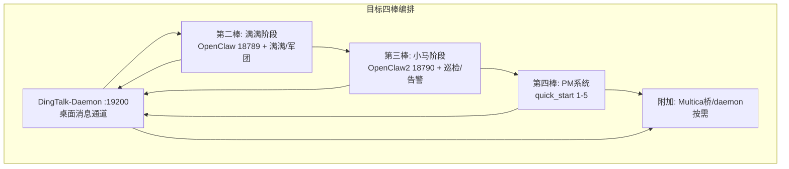
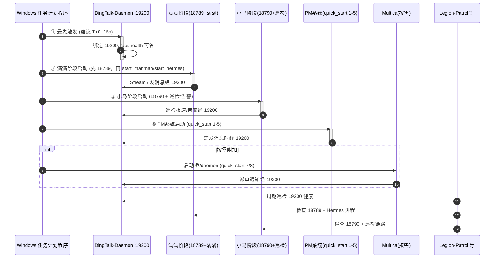

# 四栈入口脚本索引（P0）

本文登记 **`MyAgents`、`D:\hermes`、`D:\OpenClaw`、`D:\OpenClaw2`** 中与日常运维相关的入口级脚本：根目录、`scripts/`、`tools/`（MyAgents）、以及明确的 Gateway 启动器。

**不在范围：** `node_modules`、`__pycache__`、依赖目录内 `.cmd/.ps1`；业务代码树中的海量 `.py`（仅列 `MyAgents/scripts` 与 `OpenClaw/scripts` 下的辅助脚本）。

**维护约定：** 新增或废弃入口脚本时，顺手改一行；密钥与机器路径以各仓本地 `.env` / `gateway.cmd` 为准，勿把密钥写入本文档。

**横向参考：** 端口与依赖见 `.cursor/skills/multi-service-orchestration/SKILL.md`；硅基编排背景见 `docs/silicon-legion-orchestration.md`。

**日常「谁跑什么」与开机 SOP：** 见本文 **§5**；端口/计划任务/巡检真源以 **`D:\OpenClaw2\workspace\PORT_MAP.md`**、**`D:\OpenClaw2\workspace\STARTUP.md`** 为准（小马维护），本仓索引不复制易过期的 PID。

**文档枢纽（需求 / 面试 / 会议等非运行时）：** `docs/DOC_HUB.md`、`docs/narrative/README.md`。

---

## 1. MyAgents（`D:\MyAgents`）

### 1.1 仓库根与子项目 `.bat`

| 路径 | 用途（简述） |
|------|----------------|
| `start_army.bat` | 启动 LLM Plotter（Streamlit）、AlignFlow 前后端、打开 `central-console\index.html`（与 PM 子项目无直接耦合，见脚本正文）。 |
| `pm-system\quick_start.bat` | PmSystem：交互式拉起/重启后端、前端、MD Reader、Palace、钉钉通道、Multica 桥与 **Multica Daemon**（菜单项 1–8；9 全关、0 全重启）；详见 **§5.3**。 |
| `pm-system\build_and_run.bat` | PM 构建并运行流程（发布/一体化脚本，按需使用）。 |
| `pm-system\package_minimal.bat` | PM 最小打包相关。 |
| `pm-system\backend\setup_env.bat` | PM 后端环境初始化。 |
| `performeval\run.bat` | 乘法绩效后端/站点启动入口（常见）。 |
| `performeval\watchdog.bat` | PerformEval 看门狗/守护相关。 |
| `cci_system\启动.bat` | CCI Streamlit 应用启动。 |
| `FileCleanerTool\run.bat` | 文件清理工具 GUI 入口。 |
| `silicon-legion\director\start.bat` | 硅基军团 Director 入口。 |
| `silicon-legion\scripts\start.bat` | 硅基军团脚本层总启（与 advisor 配合）。 |
| `silicon-legion\scripts\start_advisors.bat` | 拉起硅基顾问侧实例。 |
| `silicon-legion\advisors\acha\start.bat` | 顾问「阿茶」入口。 |
| `silicon-legion\advisors\miaomiao\start.bat` | 顾问「妙妙」入口。 |
| `silicon-legion\advisors\xiaomei\start.bat` | 顾问「小美」入口。 |
| `silicon-legion\advisors\xiaomei\start_clean.bat` | 「小美」清理后启动变体。 |

### 1.2 `tools\`（跨工具）

| 路径 | 用途（简述） |
|------|----------------|
| `tools\kimi-myagents.cmd` | 固定以 MyAgents 根为工作区调用 `kimi -w`。 |
| `tools\openclaw-start.ps1` | OpenClaw（`D:\OpenClaw`）网关前台启动：读 `.env` 中继密钥、`openclaw gateway --port 18789`。 |
| `tools\openclaw-apply-custom-llm.ps1` | 向 OpenClaw 写入自定义 LLM/兼容网关配置（配合自建后端）。 |
| `tools\check-claude-code-running.ps1` | 检测本机是否有 `claude.exe` 或 `node` 加载 `claude-code` 包。 |
| `tools\multica-dingtalk-bridge\run_bridge.ps1` | Multica 钉钉桥：启动桥接服务（常与计划任务/守护配合）。 |
| `tools\multica-dingtalk-bridge\run_multica_daemon_isolated.ps1` | 桥接进程隔离启动变体。 |
| `tools\multica-dingtalk-bridge\register_patrol_task.ps1` | 注册 Multica 巡逻相关计划任务。 |

### 1.3 `scripts\`（仓库根下辅助 `.py`）

| 路径 | 用途（简述） |
|------|----------------|
| `scripts\gen_interview_checklist.py` | 由简历/材料生成面试清单。 |
| `scripts\gen_ops_l3_interview_checklist.py` | L3 运营向面试清单生成。 |
| `scripts\game_review_ollama.py` | 游戏评审相关 Ollama 调用脚本。 |
| `scripts\notify_tao_daemon.py` | 通过 daemon/通道通知「涛哥」类工作流。 |
| `scripts\run_resume_preview_ollama.py` | 简历预览 + Ollama。 |

### 1.4 `dingtalk-desktop\`（钉钉通道与定时周边）

**守护与运维**

| 路径 | 用途（简述） |
|------|----------------|
| `dingtalk-desktop\restart_daemon.ps1` | `POST /shutdown` 后重启 `daemon.py`，并探测 `/health`。 |
| `dingtalk-desktop\run_daemon_health_notify.ps1` | Daemon 健康检查与通知逻辑。 |

**计划任务注册（`register_*.ps1` / `.cmd`）**

| 路径 | 用途（简述） |
|------|----------------|
| `register_version_digest_task.ps1` / `register_version_digest_task_elevated.cmd` | 版本摘要类任务计划注册（ elevated 变体需管理员）。 |
| `register_pipeline_notify_task.ps1` / `register_pipeline_notify_schtasks.ps1` | 管线/流水线通知任务注册。 |
| `register_evening_digest_task.ps1` | 晚间摘要任务注册。 |
| `register_memo_reminder_task.ps1` | 备忘录提醒任务注册。 |
| `register_work_report_assistant_tasks.ps1` | 日志助手（早报/周报素材等）相关任务注册。 |

**计划任务实际执行体（`run_*.ps1`）**

| 路径 | 用途（简述） |
|------|----------------|
| `run_daily_version.ps1` / `run_version_digest.ps1` | 按日版本/版本摘要执行。 |
| `run_daily_digest.ps1` / `run_evening_digest_both.ps1` | 日终/晚间摘要执行。 |
| `run_evening_pm.ps1` / `run_evening_pmo.ps1` | 晚间 PM / PMO Digest。 |
| `run_pipeline_notify_scheduled.ps1` | 定时管线通知跑批。 |
| `run_memo_reminder.ps1` | 备忘录提醒跑批。 |
| `run_work_report_assistant.ps1` | 日志助手跑批入口。 |

---

## 2. Hermes（`D:\hermes`）

### 2.1 根目录 `.bat`（硅基 / 顾问 Gateway）

| 路径 | 用途（简述） |
|------|----------------|
| `start_all.bat` | **批量启动**多个 Hermes Gateway（清理残留 PID、按实例拉起满满/阿茶/小美/妙妙等，脚本内注释为准）。 |
| `start_advisors.bat` | 启动 **PM / HR / Design** 三条 advisor：`hermes_cli\main.py gateway run`。 |
| `start_miaomiao.bat` | `HERMES_HOME=D:\hermes\miaomiao`，妙妙实例 `hermes gateway run --accept-hooks`。 |
| `restart_*_only.bat`（`manman` / `acha` / `xiaomei` / `miaomiao` / `dangdang`） | **仅重启**对应昵称实例（通常含杀旧进程、清 `gateway.pid`、再拉起）。 |
| `restart_acha.bat` | **注意：** 当前脚本内容为拉起 **PM advisor**（`D:\hermes\pm` + `hermes_cli gateway run`），与文件名「acha」不一致；若依赖语义命名请以实际脚本为准或择机改名。 |

### 2.2 根目录 `.py`（入口）

| 路径 | 用途（简述） |
|------|----------------|
| `start_manman.py` | 满满主 Gateway：读 `D:\hermes\.env` 中继密钥，`venv\Scripts\hermes.exe gateway run --accept-hooks`，新开控制台。 |
| `start_all_gateways.py` | 为 **pm / hr / design** 目录分别拉起 gateway，日志写入各目录 `gateway.log`。 |
| `start_acha.py` / `start_acha_debug.py` | 阿茶实例启动 / 调试启动。 |
| `kill_hermes.py` | 按路径清理 Hermes 相关残留进程（被多个 `restart_*` 调用）。 |

### 2.3 `scripts\`

| 路径 | 用途（简述） |
|------|----------------|
| `scripts\multica-patrol-collect.py` | Multica 巡逻采集相关脚本。 |

### 2.4 `hermes-agent\scripts\`（安装类，非日常启停）

| 路径 | 用途（简述） |
|------|----------------|
| `hermes-agent\scripts\install.cmd` / `install.ps1` | Hermes Agent 安装/依赖初始化（装机一次）。 |

### 2.5 Skill 包内副本（易与根目录重复）

| 路径 | 用途（简述） |
|------|----------------|
| `skills\silicon-legion\silicon-legion-boot\scripts\start_all.bat` | Skill 携带的硅基批量启动脚本；**日常以根目录 `start_all.bat` 为准**，避免双维护。 |

---

## 3. OpenClaw（`D:\OpenClaw`）

### 3.1 根目录

| 路径 | 用途（简述） |
|------|----------------|
| `gateway.cmd` | **官方网关包装**：设置 `OPENCLAW_*` 状态目录与端口 **18789**，调用全局 `openclaw ... gateway`（密钥与路径以本机文件为准，勿入版本库）。 |

### 3.2 `scripts\` — 启动 Hermes / 满满链路的 `.bat`

| 路径 | 用途（简述） |
|------|----------------|
| `scripts\start_hermes.bat` | 从 OpenClaw 侧拉起 Hermes 相关进程（路径指向 `D:\hermes`）。 |
| `scripts\start_xiaoma.bat` | 小玛 / 相关实例启动入口。 |
| `scripts\start_miaomiao.bat` | 妙妙实例启动。 |
| `scripts\start_manman.bat` | 满满：`hermes gateway run --replace`。 |
| `scripts\start_manman_verbose.bat` | 满满启动（verbose 变体）。 |
| `scripts\start_manman_hermes.bat` | 满满 + Hermes 组合场景。 |
| `scripts\start_manman_myagents.bat` | 满满与 MyAgents 工作区联合场景。 |
| `scripts\hermes_terminal.bat` | 打开 Hermes 调试终端上下文。 |

### 3.3 `scripts\` — 健康检查 / 计划任务 / Git

| 路径 | 用途（简述） |
|------|----------------|
| `scripts\hermes-healthcheck.ps1` | 检查满满/阿茶/小美/妙妙 `gateway_state.json` 等并汇总告警。 |
| `scripts\openclaw-watchdog.ps1` | 探活 `http://127.0.0.1:18789/health`，失败则尝试重启网关；配计划任务（脚本头注释）。 |
| `scripts\register-openclaw-watchdog.cmd` | 注册上述 watchdog 计划任务。 |
| `scripts\is-workday.ps1` | 是否工作日判定（供其它任务调度使用）。 |
| `scripts\git-status-check.ps1` / `git-status-check.cmd` | Git 工作区状态检查。 |
| `scripts\register-git-status-check.cmd` | 注册 Git 状态检查计划任务。 |

### 3.4 `scripts\` — 排障 / 辅助 `.py`

| 路径 | 用途（简述） |
|------|----------------|
| `scripts\search_bridge.py` | 在妙妙 `agent.log` 中搜 bridge / inbound 相关行。 |
| `scripts\check_missed.py` | 按时间戳在 `agent.log` 中截取 inbound 上下文（漏单排查）。 |
| `scripts\check_miaomiao.py` | 妙妙实例检查脚本。 |
| `scripts\check_client_ids.py` | 客户端 ID 配置检查。 |
| `scripts\diff_env.py` | 环境变量/配置 diff。 |
| `scripts\recent_myagents.py` | 列举 MyAgents 近期修改文件（12h 内，排除常见大目录）。 |
| `scripts\recent_files.py` | 通用近期文件列举（实现类似 `recent_myagents`）。 |
| `scripts\test_kimi_key.py` | Kimi Key 探测/校验脚本。 |

---

## 4. OpenClaw2（`D:\OpenClaw2`）

| 路径 | 用途（简述） |
|------|----------------|
| `gateway.cmd` | 第二套 OpenClaw 网关：状态目录 **`D:\OpenClaw2`**，端口 **18790**，与 `D:\OpenClaw`（18789）并存；调用全局 `openclaw gateway`。 |

**说明：** 当前目录下**无**与 `OpenClaw\scripts` 对等的 `scripts` 子目录；辅助脚本以 `D:\OpenClaw\scripts` 或 Hermes/MyAgents 侧为准，或后续再抽到此仓。运维级启动顺序、计划任务、双挂救援见 **`D:\OpenClaw2\workspace\STARTUP.md`**。

---

## 5. 日常办公服务矩阵与标准 SOP（老大口径）

本节把「军团 + 钉钉 + Multica + PM 工具栈 + Claude Code」收拢成**一张图 + 一套操作顺序**，与 §1–§4 的脚本路径交叉引用。若与 `PORT_MAP.md` / `STARTUP.md` 冲突，**以 OpenClaw2 工作区两份文档为真源**，本索引只负责入口与决策说明。

### 5.1 服务矩阵（角色 / 入口 / 端口）

| 启动序 | 层级 | 组件 | 数量与角色 | 典型入口 | 端口 / 备注 |
|:---:|:---:|------|------------|----------|---------------|
| **1（链首）** | dingtalk-desktop | Daemon | 1 | `py -u D:\MyAgents\dingtalk-desktop\daemon.py`；`quick_start.bat 6` | **19200**；全链首棒，健康 `GET /api/health` |
| **2（满满阶段）** | Hermes + 必要配套 | 满满主控 + Hermes 通路 | 满满（总管）+ 其军团（阿茶/小美/妙妙/当当按需） | `D:\OpenClaw\gateway.cmd`（先确保 18789）；`D:\OpenClaw\scripts\start_manman.bat`；`start_hermes.bat` | 满满阶段至少包含 **OpenClaw(18789)+满满进程**，以保障 Stream/Webhook/派单链路 |
| **3（小马阶段）** | OpenClaw2 + 运维配套 | 小马运维中枢 | 小马（18790）+ 巡检/告警配套 | `D:\OpenClaw2\gateway.cmd`；巡检 `patrol_agents.py`；`emergency_webhook.py` | 小马阶段至少包含 **18790 + 巡检/告警**，作为恢复与兜底入口 |
| **4（业务工具阶段）** | PmSystem 栈 | 后端 / 前端 / 读文档 / Palace | 多 | `pm-system\quick_start.bat` 选 **1–5** | **8000 / 3005 / 8899 / 8300**；钉钉通道为菜单 **6** |
| 4+ | Multica | 派单桥 + 平台 Daemon | 桥 1 + daemon 1 | `tools\multica-dingtalk-bridge\run_bridge.ps1`；`quick_start.bat 7` / `8` | 桥 **10001**；发钉钉仍经 **19200**；与 Hermes **Stream 互斥**见 README |
| — | Claude Code | 开发 vs 审查 | **2 个用法**（非 Windows 服务） | Cursor 或 CLI 两上下文 | 无统一端口；`tools\check-claude-code-running.ps1` |
| — | 其它 | `start_army.bat` 等 | 按需 | 见 §1.1 | 与 PM/军团**无硬耦合** |

**Multica 与钉钉 Stream：** Hermes 网关与 Multica 派单桥**可能互斥抢 Stream**；是否启用 `quick_start.bat 7` 以 `STARTUP.md` 当前策略与 `multica-dingtalk-bridge\README.md` 为准。

### 5.2 现状（如何读「真」状态）

1. **计划任务与开机顺序**：`D:\OpenClaw2\workspace\STARTUP.md`（含 DingTalk-Daemon、OpenClaw、OpenClaw2、Watchdog、Legion-Patrol 等表）。
2. **端口与各 Agent 存活**：`D:\OpenClaw2\workspace\PORT_MAP.md`（含 `critical` / `auto_rescue` 与 Hermes 行表）。
3. **本机脚本入口**：本文 §1–§4；MyAgents 根 `scripts\register-*.cmd`（watchdog、git 检查等）见 §3.3。

### 5.3 目标架构：钉钉第一 → 满满第二 → 小马第三 → PM第四

**原则（已定）：**

1. **第一棒：钉钉桌面通道（daemon :19200）先起并先就绪**。后续网关、Hermes、Multica、巡检都把它当消息通道。
2. **第二棒：满满阶段 = 满满进程 + 必要配套**。最小集合是 `OpenClaw(18789)` + `start_manman.bat`，否则满满启动后链路不完整。
3. **第三棒：小马阶段 = 小马进程 + 运维配套**。最小集合是 `OpenClaw2(18790)` + 巡检/告警（`patrol_agents.py` / `emergency_webhook.py`）。
4. **第四棒：PM 系统**（`quick_start 1-5`）在三棒稳定后拉起；Multica/Claude Code按工作流按需附加。

| 维度 | 目标方案 | 现状摘要（`STARTUP.md`） |
|------|----------|---------------------------|
| 自启顺序 | **① 钉钉 → ② 满满(含 18789) → ③ 小马(含巡检告警) → ④ PM** | 现状仍偏「钉钉 + 双网关优先，满满偏手动」；需按新顺序调整计划任务与启动编排 |
| 编排职责 | 满满阶段与小马阶段都按「主进程 + 必要配套」启动，不只拉单进程 | 现有巡检与告警已在；可直接复用并前置到小马阶段 |

#### 5.3.1 依赖关系（谁依赖谁）



说明：四棒是**启动顺序**，每一棒内部包含「主进程 + 必要配套」；回箭头表示运行期仍会调用 `19200`。

#### 5.3.2 开机时序：会发生什么（计划任务视角）

以下与 `STARTUP.md` 中的任务名一致；**延迟秒数可按机器调**，关键是 **DingTalk-Daemon 第一个触发**。



**读图要点：**

- 若没有步骤 ①，后续三棒都可能「进程在、消息链路不在」。
- 第二棒与第三棒都不是单进程启动，必须把各自配套一并拉起。
- `Legion-Patrol` 仍把 **19200** 视为 critical；链首倒了优先救钉钉。

### 5.4 标准 SOP — 推荐操作顺序

**A. 每次开机或远程登录后（验证，约 3–5 分钟）**

1. 打开 `PORT_MAP.md` 或跑 Legion-Patrol / `hermes-healthcheck.ps1`（见 §2、`STARTUP.md`），按新顺序核验：**19200 → 18789+满满 → 18790+巡检 → PM 端口**。
2. 若用 PM：**8000** 后端与 **3005** 前端（浏览器自开或手输 URL）。
3. Hermes：确认满满（及需用的 Advisor/当当）进程与钉钉连接态；异常用 `start_hermes.bat` 或各 `restart_*_only.bat`（§2）。
4. Multica：仅在工作流需要时启 **7**（桥）与 **8**（daemon），并先读完 README 中与 Stream 互斥的说明。

**B. 全量手工拉起（无计划任务或换机后）**

1. **第一棒（钉钉）**：起 `dingtalk-desktop\daemon.py`（或 `quick_start.bat 6`），确认 `19200` 健康可答。
2. **第二棒（满满 + 配套）**：先起 `D:\OpenClaw\gateway.cmd`（18789），再起 `D:\OpenClaw\scripts\start_manman.bat`（或 `start_hermes.bat`）。
3. **第三棒（小马 + 配套）**：起 `D:\OpenClaw2\gateway.cmd`（18790），确认 `patrol_agents.py` / `emergency_webhook.py` 在巡检链路内正常工作。
4. **第四棒（PM 栈）**：`pm-system\quick_start.bat` 按需选 **1–5**；全量重启用 **[0]**，先清冲突用 **[9]**。
5. **按需附加（Multica）**：`quick_start.bat 7` 与 **8**，或直接 `run_bridge.ps1` / `run_multica_daemon_isolated.ps1`（`tools\multica-dingtalk-bridge\`）。
6. **工作上下文（Claude Code）**：固定「开发会话」与「审查/高难会话」两个窗口或 profile。

**C. 故障与端口冲突**

- 双挂、小马/满满互救：`STARTUP.md`「常见故障处理」。
- PM 侧多进程占端口：`quick_start.bat` 菜单 **[9] 全部关闭** 后 **[0] 全部重启**。

### 5.5 与 `start_army.bat` 的关系

`start_army.bat` 拉起的是 **LLM Plotter、AlignFlow、central-console** 等（见脚本正文），**不属于** PmSystem `quick_start` 菜单项；日常若未做对齐/实验，可**不**随军团一起开，避免端口与心智负担混淆。

### 5.6 实施脚本与落地状态（2026-04-30）

编排脚本在 `tools/startup-orchestration/`（复用 `quick_start` 的 PM 节点）：

- `boot-postlogon-chain.ps1`：**登录后**串行执行「等 `19200` → 起 `18789`+满满 → 起 `18790` → `quick_start` 1/2/3/5」；日志在 `logs\postlogon-chain-*.log`。
- `boot-phase4-pm.ps1`：仅 PM 四步，被上链调用。
- `boot-phase2-manman.ps1`：保留作**手工**第二棒（若仍用 ONSTART 任务会受 SYSTEM/用户 npm 路径影响，不推荐单独当开机任务）。
- `register-startup-chain.ps1` / `register-startup-chain.cmd`：管理员注册任务。
- `README.md`：**满满/小马不起**时的根因（ONSTART + SYSTEM vs 用户目录下 `openclaw`）。

**推荐任务模型（与注册脚本一致）：**

| 任务 | 触发 | 作用 |
|------|------|------|
| `DingTalk-Daemon` | **ONSTART** +15s | 链首，尽量早于登录也可用 |
| `Legion-PostLogon-Bootstrap` | **ONLOGON** +1min | 满满+小马+PM（需已登录用户会话，才能起 npm 下的 OpenClaw） |
| `OpenClaw Gateway` | **禁用** | 避免与链内 `18789` 重复 |

管理员落地（**管理员 cmd** 可直接双击 `register-startup-chain.cmd`，或）：

```bat
cd /d D:\MyAgents\tools\startup-orchestration
powershell -NoProfile -ExecutionPolicy Bypass -File "D:\MyAgents\tools\startup-orchestration\register-startup-chain.ps1"
```

验证：

```powershell
schtasks /Query /TN "DingTalk-Daemon" /V /FO LIST
schtasks /Query /TN "Legion-PostLogon-Bootstrap" /V /FO LIST
schtasks /Query /TN "OpenClaw Gateway" /V /FO LIST
```

---

## 6. 修订记录

| 日期 | 说明 |
|------|------|
| 2026-04-30 | 初版：四栈 P0 入口索引（按目录枚举 + 抽样读脚本）。 |
| 2026-04-29 | §5：服务矩阵、SOP、`quick_start` 8/9/0；§5.3 **钉钉链首**、Mermaid 依赖图与时序图；与 `STARTUP`/`PORT_MAP` 对齐。 |
| 2026-04-30 | 新增 `tools/startup-orchestration/`；§5.6 改为 **ONSTART 钉钉 + ONLOGON 军团链**（`Legion-PostLogon-Bootstrap`），避免 SYSTEM 起不来用户 npm 下 OpenClaw。 |
