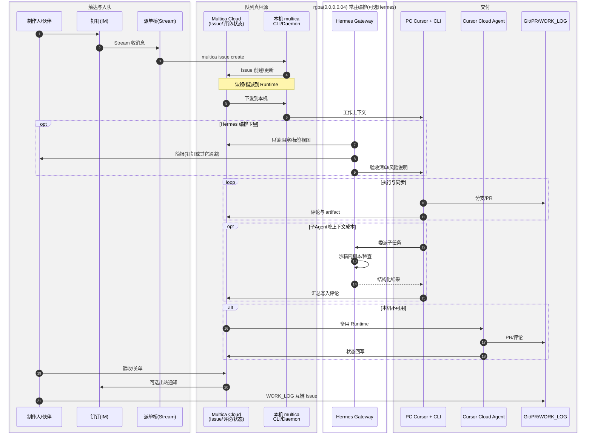
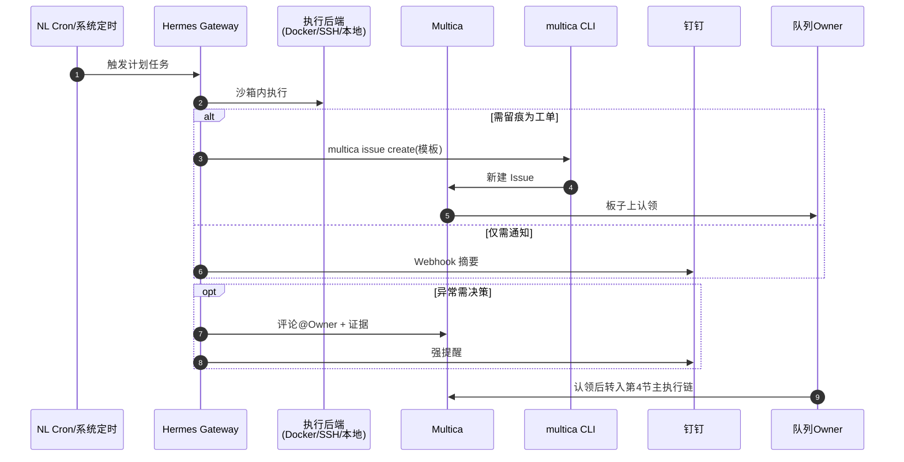

# Hermes Agent 与 Multica / 钉钉 / Cursor 协作流程（规划稿）

> **状态**：规划与流程约定；Hermes 为可选组件，落地以实际安装与内网合规评估为准。  
> **日期**：2026-04-19  
> **依据**：Multica 接入设计 `2026-04-18-multica-integration-design.md`（方案 A、钉钉桥、Issue 真相源）；会话结论与 [Hermes Agent 官网](https://hermes-agent.nousresearch.com)、[GitHub 仓库](https://github.com/NousResearch/hermes-agent) 公开能力描述。

---

## 1. 文档目的

说明在 **已接入 Multica（multica.ai）**、**钉钉 Stream 派单桥**（`tools/multica-dingtalk-bridge`）、**PC 端 Cursor + CLI 为主力、Cursor Cloud Agent 为备用** 的前提下，若引入 **Hermes Agent**，协作面与执行面如何分工、端到端流程如何运转，以及与 **Issue 拆单**（见 Multica spec **§7.1**）的衔接。

---

## 2. 能力定位（谁做什么）

| 组件 | 定位 | 不承担 |
|------|------|--------|
| **Multica（Issue）** | 队列与协作 **真相源**：状态、指派、评论时间线、多 Runtime 认领 | 不替代 pm-system 等业务系统数据；不存放密钥明文 |
| **钉钉 + 派单桥** | 碎片 **入站派单**（`#派单` → 本机 `multica issue create`）、可选 **出站强提醒** | 不作为代码/密钥真相源；不替代 Multica 写状态 |
| **PC Cursor + CLI** | **主力交付**：实现、自测、PR、与仓库 Skill/门禁一致 | 不必 7×24 承担全部定时巡检 |
| **Cursor Cloud Agent** | 本机不可用或需隔离时的 **备用 Runtime** | 不定义为默认主路径 |
| **Hermes Agent**（若引入） | 常驻 **网关 / 定时编排 / 子 Agent 沙箱执行**：NL cron、并行子任务、简报；可选读板摘要 | 不抢 Multica 的「关单权威」；**不默认**无授权自动批量建 Issue |
| **Git + WORK_LOG** | 工程交付与记录互链（关单摘要 + `Multica: #…`） | — |

**Hermes 公开能力摘要**（以官网为准）：多通道入口（Telegram、Discord、Slack 等）、持久记忆与 skills 复利、自然语言定时任务、隔离子 Agent 与多类执行后端（本地 / Docker / SSH 等）、浏览器与多模态相关工具链。

**与钉钉的关系**：Hermes **原生通道列表不含钉钉**。若要从钉钉驱动 Hermes，须 **自建桥**（验签、allowlist、与现有派单桥并列或合并），或保留 **钉钉 → Multica**、**Hermes → 其他已支持 IM / CLI** 的分工。

---

## 3. Issue 拆单与 Hermes 的边界

拆单原则以 Multica spec **§7.1** 为准，此处只固定与 Hermes 的接口：

- **拆不拆**：由 **任务复杂度 + 代码影响面** 决定；Owner 最终负责；执行中可补拆并 @Owner。
- **Hermes**：可提供 **拆单建议、验收清单、风险闸门**；若团队未显式打开策略，**不**自动在 Multica 上批量创建子 Issue，避免噪声与责任模糊。

---

## 4. 端到端泳道（日常工单）

**说明**：Cloud Agent 仅在降级路径出现；Hermes 为可选「编排卫星」。

---

## 5. 端到端泳道（无人值守 / 定时）

适用于巡检、健康探针、周报素材、模板化「开单」等。

---

## 6. 技能与记忆（与仓库的衔接）

- **仓库正本**：`.cursor/skills/` 与 `.cursor/rules/` 仍为 **AgentX / Cursor 侧** 权威 Skill 与门禁文本；Multica spec 已明确 Multica **不替代** Skill 仓库。
- **Hermes** 若使用自带 skills / 记忆：团队需约定 **主库**（避免两套 drift），可选策略包括：仅 Hermes 存运行时缓存、重要流程回写 PR 到 `.cursor/skills`、或标明「Hermes 本地 skill 为实验」等。

---

## 7. 安全与合规（引入前必选项）

- **IM 控制面**：任何「对话即执行」必须有 **身份鉴权、命令 allowlist、危险操作二次确认、审计日志**。
- **数据驻留**：Multica 方案 A 下 Issue 正文可能出内网，与 Hermes 通道、模型调用叠加后须按 **Multica spec §3.1 / 方案 C 脱敏** 执行。
- **执行后端**：优先对不可信脚本使用 **Docker / SSH 隔离**，与主力开发机分离。

---

## 8. 参考链接

- Hermes 官网：<https://hermes-agent.nousresearch.com>  
- Hermes GitHub：<https://github.com/NousResearch/hermes-agent>  
- Multica：<https://multica.ai/app>  
- 本仓：`docs/superpowers/specs/2026-04-18-multica-integration-design.md`、`tools/multica-dingtalk-bridge/README.md`

---

## 9. 修订记录

| 日期 | 变更 |
|------|------|
| 2026-04-19 | 初版：定位表、拆单与 Hermes 边界、双泳道 Mermaid、技能与安全注意事项 |
