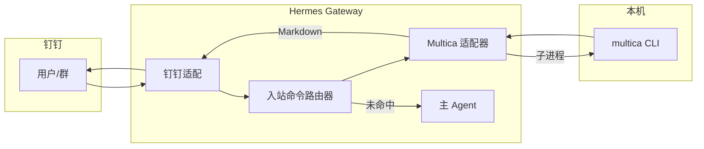

# Hermes 入站命令路由器 + Multica 适配器（钉钉单入口）

> **状态**：设计 spec（待实现）；与 brainstorming 结论一致。  
> **日期**：2026-04-21  
> **依据**：`2026-04-18-multica-integration-design.md`、`2026-04-19-hermes-agent-multica-collaboration.md`、`tools/multica-dingtalk-bridge/dispatch_bot.py`（行为对齐源）、`docs/hermes-dingtalk-gateway.md`。

---

## 0. 现网状态与割接前提（运维事实）

**截至本 spec 编写时的现网**：

- 钉钉侧 **并非** 由 Hermes 网关收消息；Multica 派单仍依赖 **`dispatch_bot.py`（派单桥）** 或其它既有路径。
- 为保证 **Multica 正常运作**，已 **断开 Hermes 网关与钉钉机器人** 的配置关联（避免与派单桥 **争抢同一条 Stream**）。

**对测试与上线的含义**：

- **Stream 单活**：同一钉钉应用（同一 Client ID）在任一时刻只能由 **一个** 进程持有 Stream 连接。切换「谁收消息」= **运维动作**，不是仅改代码开关。
- **测试 Hermes 路由时必须显式切换**：在钉钉开放平台 / 机器人侧把连接与凭证切到 **Hermes 测试环境**（或改用 **独立测试应用**），并 **停止** 指向同一应用的 `dispatch_bot`；测完若要恢复现网派单，需 **反向切换**（停 Hermes、恢复桥、恢复机器人配置）。
- **推荐**：长期用 **两套钉钉应用**（生产派单桥一套、Hermes+路由一套），从根上避免「测 Hermes 就要断生产 Multica」；若短期只有一套应用，则所有 Hermes 联调窗口需写入 **变更窗口** 与 **回滚步骤**（见 §9）。

---

## 1. 目标与范围

### 1.1 目标

- 钉钉 **仅 Hermes** 占用 **一条** Stream 连接；**不再**常驻 `tools/multica-dingtalk-bridge/dispatch_bot.py`。
- 在 Hermes 网关内实现 **入站命令路由器**：对命中语法的消息 **短路**（不调主 LLM Agent），由 **Multica 适配器** 调用本机 `multica` CLI，回复 Markdown；未命中则走既有 Hermes 对话管线。
- 第一期行为与现派单桥 **主路径对齐**（见 §4）。

### 1.2 非目标（本期不做）

- 替代 Multica Cloud / 自建 Multica 的部署形态（见 `2026-04-21-multica-selfhost-production-design.md` 另行演进）。
- 在 Hermes 内实现 pm-system 等业务写库；工单真相源仍为 **Multica Issue**。

---

## 2. 术语与命名

| 名称 | 含义 |
|------|------|
| **入站命令路由器（Inbound Command Router）** | 平台无关概念：在「鉴权之后、主 Agent 之前」对**纯文本指令**做有序匹配；命中则委托已注册适配器并 **短路返回**。 |
| **Multica 适配器** | 路由器下的第一个后端适配器：解析派单/删单/查单等语法，执行 `multica` 子进程，格式化钉钉侧 Markdown。 |
| **主 Agent** | 现有 Hermes 对话与工具链；仅处理未被路由器消费的消息。 |

说明：对外文档与代码目录可用 `inbound_command_router` + `adapters/multica` 等英文名；与用户沟通时采用上表中文名。

---

## 3. 架构与职责

| 单元 | 职责 |
|------|------|
| Hermes 钉钉入站 | **目标态**：由 Hermes 收消息；用户鉴权、群 @ 等以 Hermes 钉钉适配器为准（与现网「桥收消息」可并存于文档，但 **同一应用不可双连**，见 §0）。 |
| **入站命令路由器** | 按 §6 **注册顺序**调用各适配器 `try_handle(text, context) -> Optional[Reply]`；首个非空即短路。 |
| **Multica 适配器** | 实现现 `dispatch_bot` 主路径语义（§4）；子进程、超时、stderr 记录。 |
| **主 Agent** | 路由器未命中时的默认路径。 |
| 本机 `multica` CLI | 与现桥一致；登录与 workspace 由运维保证。 |
| **MyAgents 仓库** | 本 spec、`quick_start` 与运维说明、回归清单；可选：从 Hermes 补丁仓库子模块或文档互链。 |

---

## 4. Multica 适配器：与现派单桥主路径对齐

实现期应以 `dispatch_bot.py` 为 **行为金线**（含边界与帮助文案），本节仅列 **契约摘要**，避免与代码双线漂移。

### 4.1 建单

- 触发：`派单` / `#派单`（首行标题、续行描述；空标题走帮助文案）。
- 动作：`multica issue create`（标题、描述、优先级等参数与现桥一致；可选 `MULTICA_PROJECT_ID`）。
- 回复：成功时 Markdown 版式与现桥一致（编号置顶、分隔线、`[点击查看](url)`、待办数等逻辑对齐 `_format_dispatch_create_reply`）。

### 4.2 取消 / 删除派单

- 触发：`删除派单` / `#删除派单`、`取消派单` / `#取消派单`；支持短号、`UUM-n` 形式、多目标分隔、UUID；无目标时返回 `_DELETE_DISPATCH_HELP` 类说明。
- 动作：`multica issue status … cancelled`（Multica 无物理删除，与现桥一致）。

### 4.3 查工单

- 触发：`查工单` / `#查工单`。
- 动作：`multica issue list`（JSON）+ 与现桥一致的统计与「按优先级前 10」排序规则（不含已取消等）。

### 4.4 环境与路径

- `MULTICA_BIN`、`MULTICA_PROJECT_ID`、`MULTICA_APP_URL`、`MULTICA_WORKSPACE_WEB_PATH` 等：与 `tools/multica-dingtalk-bridge/README.md` 对齐。
- 子进程 **cwd** 建议与现 Hermes `terminal.cwd`（如 `d:/MyAgents`）一致，便于与仓库脚本协作；以实施时验证为准。

---

## 5. Hermes 接入点（实施约束）

- **位置原则**：在「用户已授权、消息已解析为可路由文本」之后，在「进入主 Agent / LLM」之前插入路由器调用。
- **候选挂载点**（实施时择一并在实现计划中写死）：
  - 网关统一 `_handle_message`（或等价）中、构建 Agent 上下文之前；或
  - 钉钉适配器在 `handle_message` 委托网关前的分支。
- **短路语义**：路由器返回非空回复时，由钉钉适配器 **直接发送** 该 Markdown，并 **跳过后续 Agent 调度**。

具体文件与函数名以 Hermes 版本为准；本 spec 只固定 **语义位置**，不绑定行号。

---

## 6. 第二条、第三条服务：注册约定

路由器对 **所有后端适配器** 使用同一契约，便于并列扩展（与 Multica 平行的其他 CLI / HTTP 服务）。

### 6.1 适配器接口（逻辑契约）

每个适配器须实现：

1. **`priority: int`** — 整数，**越小越先**尝试；同优先级以注册顺序为准。
2. **`try_handle(context) -> Optional[RouterReply]`**  
   - **入参 `context`** 至少包含：`platform`（如 dingtalk）、`chat_id`、`user_id`、**规范化正文** `text`、可选 `raw` 引用。  
   - **返回** `None` 表示本适配器不处理；返回 `RouterReply(body_markdown, …)` 表示由路由器短路并回传钉钉。
3. **命名空间** — 每个适配器应在文档中列出 **独占指令前缀/关键词表**；冲突时以 **priority + 显式注册表** 解决，禁止隐式「谁写在后面谁赢」。

### 6.2 注册表（配置建议）

- **静态注册**（第一期）：代码或配置 YAML 中列出 `[MulticaAdapter(), …]`。
- **特性开关**：每适配器可选环境变量，例如 `HERMES_ROUTER_MULTICA_ENABLED=1`；路由器跳过 `disabled` 项。
- **日志前缀**：`[router][multica]`、`[router][foo]`，便于排障。

### 6.3 新增第二条、第三条服务时的检查清单

1. 是否引入 **与现有指令冲突** 的关键词？若冲突，是否改为 **显式前缀**（如 `#pm …`）或提高区分度？
2. 子进程 / HTTP **超时** 与 **并发** 上限是否与网关全局策略一致？
3. **凭据**是否独立于 Multica（各自 env），且不落日志明文？
4. 失败时用户可见文案是否 **不泄露** 内部栈（仅摘要 + 日志详情）？
5. 是否在 MyAgents 增加 **一条回归用例** 或手工清单项？

### 6.4 与 Multica 的关系

- Multica 适配器在注册表中 **priority 建议为 10**（占位）；更「窄、更具体」的适配器可用更小 priority 抢先消费（例如仅匹配 `#pm` 的内部工具）。
- 若未来存在「自然语言也能建 Multica 单」的 Agent 能力，仍应以 **路由器命中为优先**；避免双路径重复建单（实施时可用「仅路由器处理派单关键词」的文档约束 + 可选去重键）。

---

## 7. 配置与运维

| 项 | 说明 |
|----|------|
| 总开关 | 建议 `HERMES_INBOUND_ROUTER_ENABLED`（默认关，便于分环境 rollout）。 |
| Multica 开关 | `HERMES_ROUTER_MULTICA_ENABLED` 或与总开关联动。 |
| 钉钉 | 仍使用 Hermes 既有 `DINGTALK_*` 与 `HERMES_HOME` 约定（见 `docs/hermes-dingtalk-gateway.md`）。 |

---

## 8. 错误处理、超时、幂等

- **子进程**：设置 wall-clock 超时；非零退出码 → 用户侧简短失败说明 + 日志保留 stderr 尾部。
- **幂等**：钉钉 Stream 重试可能导致重复投递；建单路径实施时评估 **客户端去重键** 或「同 chat 同标题短时间拒绝二次」策略（与产品确认后写入实现计划）。
- **降级**：总开关关闭时，行为与 **未打补丁的 Hermes** 一致；派单能力需运维明确「关路由 = 无派单」或临时恢复 **独立钉钉应用 + 旧桥」（应急，与单 Stream 目标冲突，仅灾备叙述）。

---

## 9. 测试、配置切换与回滚

### 9.1 单元与集成（功能面）

- **单元测试**：各适配器解析函数（从 `dispatch_bot` 抽离或复制逻辑后）与 golden cases。
- **集成**：本机 Hermes + 钉钉：**建单**、**多目标删单**、**查工单**、**非指令闲聊**各至少 1 条。

### 9.2 配置切换检查清单（现网 vs Hermes 测试）

在实施与联调前按顺序核对（**缺一可能导致「无回复」或抢线**）：

| 步骤 | 动作 |
|------|------|
| 1 | 确认钉钉 **哪一个应用** 的 Client ID / Secret 将接到 Hermes（`D:\hermes\.env` 或测试 profile）。 |
| 2 | **停掉** 使用该同一套凭证的 **`dispatch_bot`**（及 `quick_start` 若曾自动拉起派单桥）。 |
| 3 | 在钉钉开放平台确认该机器人 **Stream 模式** 且 **仅本机 Hermes 网关** 在跑 `hermes gateway`（或测试实例）。 |
| 4 | 测完后若要恢复 **现网 Multica 派单**：**停 Hermes** → **恢复** 机器人与派单桥所用配置一致 → **再起** `dispatch_bot`（或原入口）。 |

**双应用策略（推荐）**：生产机器人继续接派单桥；复制一个 **仅测试群可见** 的钉钉应用接 Hermes，则 **无需** 在每次测试时断开现网。

### 9.3 回滚（软件面）

- 关闭路由开关；Git 回退 Hermes 补丁分支；若曾改 `quick_start`，恢复与派单桥相关的菜单与说明。
- **回滚（连接面）**：与 §9.2 步骤 4 相同——以钉钉侧「谁连 Stream」为准，**软件回滚不等于自动恢复 Stream 持有方**。

---

## 10. 相关文档

- `docs/superpowers/specs/2026-04-18-multica-integration-design.md`
- `docs/superpowers/specs/2026-04-19-hermes-agent-multica-collaboration.md`
- `docs/hermes-dingtalk-gateway.md`
- `tools/multica-dingtalk-bridge/README.md`（运维变量与排障，直至桥退役）

---

## 11. 修订记录

| 日期 | 变更 |
|------|------|
| 2026-04-21 | 初稿：入站命令路由器 + Multica 适配器；取代派单桥；§6 注册约定支持并列服务。 |
| 2026-04-21 | 增补 §0 现网非 Hermes、已断开 Hermes–钉钉以保证 Multica；§9.2 配置切换清单与双应用策略。 |
