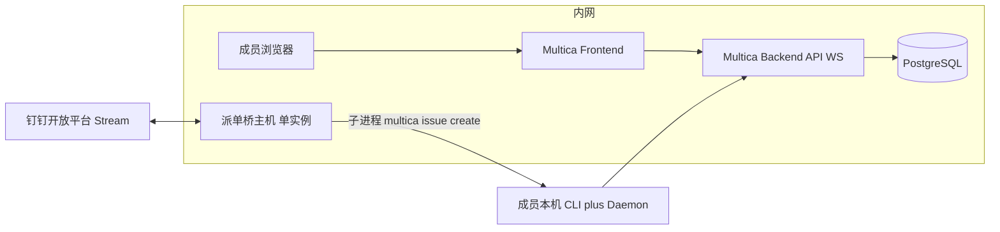

# Multica 内网生产与钉钉派单 — 交接包（合并版）

> **用途**：单文件转发给同事（部署 + 协作 + 派单桥细节）。仓库内仍以分文件维护；若分文件有更新，可重新运行合并脚本或让我方重新导出。
> **快照日期**：2026-04-21

## 目录

- Part A — 设计说明（架构、边界、单桥约束）
- Part B — 部署 Runbook（按任务勾选）
- Part C — 全员协作指南（上线后日常）
- Part D — 钉钉 Stream 派单桥 README（环境变量、指令、排障）

---

## Part A — 设计说明

**仓库原路径：** docs/superpowers/specs/2026-04-21-multica-selfhost-production-design.md

### Multica 内网生产环境 — 设计说明

> **状态**：已定稿供评审；实施以本文 **Part B（部署 Runbook）** 为准（仓库内另有同内容分文件，路径见 Part B 节标题下「仓库原路径」）。  
> **日期**：2026-04-21  
> **范围**：在保留「制作人本机 Cloud + 钉钉桥调试」的前提下，新增 **内网正式 Multica（自托管）** 的边界、角色、依赖与协作接口；与既有 `2026-04-18-multica-integration-design.md` 对齐并扩展 **方案 B**。

---

#### 1. 文档索引（给交接同事）

本 **合并版** 内对应关系（便于单文件阅读）：

| 部分 | 读者 | 用途 |
|------|------|------|
| **Part A**（本节起） | 制作人 / 架构 / 运维 | **为什么这样切**、边界、风险、与 Cloud 调试关系 |
| **Part B** | 负责落地的工程师 | **按任务勾选**完成部署与验收 |
| **Part C** | 全体使用者 | 上线后 **日常怎么用**（Web、CLI、钉钉、WORK_LOG） |
| **Part D** | 运维 / 派单桥维护者 | 钉钉 `.env`、发单格式、排障 |

上游权威（版本以官方仓库为准）：

- [SELF_HOSTING.md](https://github.com/multica-ai/multica/blob/main/SELF_HOSTING.md)
- [SELF_HOSTING_ADVANCED.md](https://github.com/multica-ai/multica/blob/main/SELF_HOSTING_ADVANCED.md)

---

#### 2. 背景与目标

##### 2.1 现状

- **调试环境**：制作人本机使用 **Multica Cloud**（`multica.ai`）+ 本机 `multica` CLI + 可选 **`tools/multica-dingtalk-bridge`**（钉钉 Stream 入站派单）。用于个人试流程、脚本联调。
- **缺口**：缺少 **数据驻留在内网**、**团队共用同一真相源** 的正式实例；Cloud 与内网合规策略可能不一致。

##### 2.2 目标（可验收）

1. **内网可访问**：浏览器可打开正式 Web；API/WebSocket 经内网域名或 IP 可达（生产建议 HTTPS + 反代）。
2. **队列真相源**：团队默认在内网 Multica **Workspace** 内创建、认领、关闭 Issue；与个人 Cloud 调试板 **刻意分离**。
3. **钉钉派单**：**仅一套** 生产机器人 Stream 连接对应 **单实例派单桥**（见 §5）；建单写入 **内网** Multica（通过桥所在机的 CLI 指向内网 `server_url` / `app_url`）。
4. **可运维**：备份、升级路径、负责人明确；故障时有降级说明（见 Runbook）。

##### 2.3 非目标（首版不做）

- 不迁移历史 Cloud Issue 自动对账（若需要，另开专项与时间点）。
- 不在本文规定 **LLM 供应商** 选型；daemon 本机执行仍受各 Agent CLI 与网络策略约束（与 Multica 服务是否内网无关）。
- 不把 Multica 替代 pm-system 等业务数据（与既有 spec 一致）。

---

#### 3. 方案定位（与既有 §3 对齐）

| 条目 | 调试（个人） | 生产（团队） |
|------|--------------|--------------|
| Multica 服务 | Cloud `multica.ai` | **自托管**（Docker：Frontend + Backend + Postgres） |
| 数据驻留 | 依 Cloud 条款 | **内网** |
| 钉钉桥 | 本机可启停 | **固定一台**常驻；**禁止**同 Client ID 多机并发 |
| CLI `multica config` | 个人可指向 Cloud | 正式协作机 **指向内网 URL** |

对应既有文档 **方案 B：全栈自托管（Docker，内网）**；个人调试继续可用 **方案 A**，两套并存时以 **URL 与 workspace** 区分，避免误操作。

---

#### 4. 逻辑架构



要点：

- **状态与协作** 在 Multica（Issue、评论、状态、指派）。
- **Agent daemon** 仍在各人电脑，向 **内网 Backend** 注册 Runtime；不在 Docker 内跑同事 IDE。
- **钉钉桥** 只做入站（及可选出站 Webhook），**不是** Multica 子服务；代码在 `tools/multica-dingtalk-bridge/`，与 multica 官方镜像 **独立发布周期**。

---

#### 5. 钉钉派单桥 — 生产约束（必须遵守）

1. **同一钉钉应用（同一 Client ID）** 对应 **唯一** `dispatch_bot.py` 进程；多机同时跑会抢 Stream，行为不可预期（仓库 README 已说明）。
2. **桥所在机** 必须：安装 `multica` CLI、完成 **对内网** 的 `multica setup self-host`（或等价 `config set server_url` / `app_url`）、`multica auth status` 可用；且该机能访问钉钉开放网络与内网 API。
3. **环境变量**：生产 `.env` 中建议显式设置 **`MULTICA_APP_URL`**（与内网前端一致），保证机器人回复里「点击查看」指向内网而非 `multica.ai`。
4. **密钥**：`DINGTALK_CLIENT_*` 仅密码库或受控渠道交接，**禁止**贴群、进 Git。

---

#### 6. 角色与职责（RACI 摘要）

| 事项 | 运维 / 部署同事 | 队列 Owner | 普通成员 |
|------|-----------------|------------|----------|
| Docker、反代、证书、DB 备份 | R/A | I | I |
| 内网域名、防火墙放行策略 | R | I | I |
| 正式 Workspace / Project 命名与归档规则 | C | A | I |
| 派单桥部署机选型与启停窗口 | R | A | I |
| Issue 纪律、拆单、WORK_LOG 互链 | I | A | R |

（R=执行，A=拍板，C=协商，I=知会）

---

#### 7. 安全与合规

- **认证**：生产默认关闭「万能验证码」；优先企业可接受的 **邮件验证码**（`RESEND_API_KEY` 等，见官方文档）或组织规定的 IdP 路径（若后续集成）。纯内网评估期若用 `APP_ENV=development`，**必须**网络层保证 **公网不可达**。
- **传输**：对前端与 API 使用 **HTTPS**；WebSocket 与反代超时按 `SELF_HOSTING_ADVANCED.md` 调整。
- **敏感描述**：工单正文仍可能含业务细节；强合规场景在 Issue 写 **「详见内网 WORK_LOG / 某路径」**，正文脱敏（对应既有 **方案 C** 思路）。

---

#### 8. 与既有试点文档的关系

- `2026-04-18-multica-integration-design.md`：协作纪律（关单、WORK_LOG、拆单 §7.1）**继续有效**。
- `2026-04-18-multica-integration.md`（plan）：偏 Cloud + 本机桥 **试点实施**；本设计将 **生产后端** 迁到内网后，桥与 CLI 的 **URL 与凭据** 切换以 Runbook 为准。

---

#### 9. 修订记录

| 日期 | 变更 |
|------|------|
| 2026-04-21 | 初版：内网生产 + 调试并存、单桥、三文档拆分。 |

---

## Part B — 部署 Runbook

**仓库原路径：** docs/superpowers/plans/2026-04-21-multica-selfhost-production-deploy-runbook.md

### Multica 内网生产环境 — 部署 Runbook

> **For agentic workers:** 可按 checkbox 逐项执行；不涉及本仓库业务代码改动时无需 subagent 流水线。  
> **Goal:** 在内网交付一套 **团队共用的 Multica 自托管实例**（含 Postgres、前后端），并接通 **单实例钉钉派单桥**；成员 CLI 指向内网后可正常建单、认领、daemon 注册。

**Architecture:** 官方 `docker-compose.selfhost.yml` 三件套；可选反向代理终止 TLS；钉钉桥独立进程调用本机 `multica` CLI 写内网 API。

**Tech Stack:** Docker / Docker Compose、PostgreSQL 17（pgvector）、Multica 上游镜像与 compose 文件、内网 Linux 服务器（推荐）；派单桥为 Python + `dingtalk-stream`（见 `tools/multica-dingtalk-bridge/requirements.txt`）。

**设计依据:** 本文 **Part A**（仓库分文件：`docs/superpowers/specs/2026-04-21-multica-selfhost-production-design.md`）

---

#### 前置阅读（5 分钟）

- 上游：[SELF_HOSTING.md](https://github.com/multica-ai/multica/blob/main/SELF_HOSTING.md)
- 上游进阶（反代、邮件、环境变量）：[SELF_HOSTING_ADVANCED.md](https://github.com/multica-ai/multica/blob/main/SELF_HOSTING_ADVANCED.md)
- 本合并版 **Part D**（仓库：`tools/multica-dingtalk-bridge/README.md`）

---

##### Task 1: 环境与账号准备

**交付物:** 服务器可 SSH、有 Docker 与 Compose v2；内网 DNS 或 hosts 规划就绪。

- [ ] **Step 1:** 确认目标机 OS（推荐 Linux x86_64）与磁盘（DB 与镜像增长预留）。
- [ ] **Step 2:** 安装 Docker Engine 与 Docker Compose Plugin（版本满足上游要求）。
- [ ] **Step 3:** 规划三个信息（可先占位，Task 3 落定）：  
  - 前端 URL，例：`https://multica-app.corp.local`  
  - API URL，例：`https://multica-api.corp.local`  
  - 派单桥宿主机：固定一台（可与 Multica 同机或不同机）

---

##### Task 2: 获取并启动 Multica 自托管栈

**交付物:** `docker compose ps` 全绿；本机 curl 可访问 `localhost:3000` 与 `localhost:8080`（或 compose 映射端口）。

- [ ] **Step 1:** 克隆官方仓库（版本以团队锁定 commit 为准，便于 reproducible）：  
  `git clone https://github.com/multica-ai/multica.git`  
  `cd multica`
- [ ] **Step 2:** 生成运行配置（二选一）：  
  - `make selfhost`（自动生成 `.env`、JWT 等并拉起），或  
  - 手动：`cp .env.example .env`，设置强随机 `JWT_SECRET`，再  
    `docker compose -f docker-compose.selfhost.yml up -d`
- [ ] **Step 3:** 阅读容器日志，确认 backend 迁移无报错、frontend/backend health 正常。

---

##### Task 3: 反向代理与 TLS（生产推荐）

**交付物:** 浏览器通过 **HTTPS** 打开前端；CLI 配置使用 **HTTPS API**；WebSocket 升级头透传无 404/502。

- [ ] **Step 1:** 按 `SELF_HOSTING_ADVANCED.md` 配置 Nginx / Caddy / 企业网关：  
  - `app_url` 域名指向前端服务  
  - `server_url` 域名指向 API（含 WebSocket 路径规则）
- [ ] **Step 2:** 用内网 CA 或企业证书加载 TLS；**禁止**在无网络隔离下使用 `APP_ENV=development` + 万能码对公网暴露。
- [ ] **Step 3:** 从 **另一台内网客户端** 访问 Web，完成一次页面加载与登录页打开（先不必全员账号）。

---

##### Task 4: 登录与首账号策略

**交付物:** 至少一名管理员可登录 Web；团队知悉验证码获取方式（邮件或受控 dev 模式）。

- [ ] **Step 1:** 选定认证方式（推荐生产：`RESEND_API_KEY` + 真实邮箱域；或组织规定的 SMTP/IdP，以官方 advanced 为准）。
- [ ] **Step 2:** 若短期纯内网 PoC 使用 `APP_ENV=development`：**书面确认**网段 ACL，仅内网可达。
- [ ] **Step 3:** 创建 **正式 Workspace** 命名规范（例：与仓库/中心名一致），创建默认 **Project**（如 `pm-system` 或 `MyAgents`），记录 **workspace_id**、**project_id**（UUID）。

---

##### Task 5: 成员 CLI 与 daemon（抽样验收）

**交付物:** 在一台 **Windows 或 macOS** 样本机上，`multica auth status` 成功、`multica workspace list` 可见内网 workspace、Settings → Runtimes 可见本机。

- [ ] **Step 1:** 在样本机安装官方 `multica` CLI（Windows 见上游 `CLI_AND_DAEMON.md`）。
- [ ] **Step 2:** 执行：  
  `multica setup self-host --server-url <HTTPS-API> --app-url <HTTPS-App>`  
  完成浏览器登录。
- [ ] **Step 3:** 安装至少一种受支持 Agent CLI（如 `cursor-agent`），执行 `multica daemon start`，在 Web **Settings → Runtimes** 确认在线。
- [ ] **Step 4:** 手工 `multica issue create` 一条测试 Issue，Web 可见；然后关闭或取消以免污染。

---

##### Task 6: 钉钉派单桥（生产单实例）

**交付物:** 仅 **一台** 主机长期运行 `dispatch_bot.py`；群内 `#派单` 可在内网 Multica 看到新 Issue；机器人回复链接指向 **内网** `MULTICA_APP_URL`。

- [ ] **Step 1:** 选定主机；确认该主机 **不会**与他人重复启动同一钉钉 Client ID 的桥。
- [ ] **Step 2:** Clone 本仓库 `MyAgents`（或最小化同步 `tools/multica-dingtalk-bridge/` + 依赖文件），创建 `.venv`，`pip install -r tools/multica-dingtalk-bridge/requirements.txt`。
- [ ] **Step 3:** 在该机配置 `multica` 为 **内网** `setup self-host`（与 Task 5 一致），`multica issue create` 手工成功。
- [ ] **Step 4:** 复制 `tools/multica-dingtalk-bridge/.env.example` 为 `.env`，填入 `DINGTALK_CLIENT_ID`、`DINGTALK_CLIENT_SECRET`；设置 `MULTICA_APP_URL=<HTTPS-App>`；可选 `MULTICA_PROJECT_ID=<正式项目UUID>`。
- [ ] **Step 5:** Windows 用 `run_bridge.ps1` 或计划任务/ nssm 守护；Linux 用 systemd 调用 `python dispatch_bot.py`。详见 `README.md`。
- [ ] **Step 6:** 钉钉侧发一条 `#派单` 测试，Web 验证；机器人回复中链接打开为内网。

---

##### Task 7: 网络与安全基线

**交付物:** 防火墙策略文档化；仅必需端口暴露。

- [ ] **Step 1:** DB 端口 **不对**办公网全局开放，仅 Docker 网络或本机 loopback。
- [ ] **Step 2:** 前端/API 仅从内网访问；若需 VPN，写明接入条件。
- [ ] **Step 3:** 派单桥主机：出站需钉钉 Stream 相关域名（以钉钉文档为准）+ 内网 Multica API。

---

##### Task 8: 备份与恢复试跑

**交付物:** 一次成功的 Postgres 逻辑备份与还原演练记录（日期、命令、耗时）。

- [ ] **Step 1:** 为 `postgres` 容器卷或 DB 实例配置定时 `pg_dump`（策略由 DBA 定）。
- [ ] **Step 2:** 在测试环境或维护窗口做一次 **restore 演练**（不写进生产同名 volume 除非已停机切换）。

---

##### Task 9: 上线验收清单（Go/No-Go）

- [ ] Web HTTPS 打开无混合内容错误。
- [ ] 非部署机浏览器可登录并完成一次 Issue 状态变更。
- [ ] 样本机 daemon 在线，可被指派测试 Issue（可选）。
- [ ] 钉钉 `#派单` 创建 Issue 成功，链接指向内网。
- [ ] **未**发现第二台机器同时跑同一钉钉 Client ID 桥。
- [ ] 全员可见协作指南：本文 **Part C**（或仓库 `docs/superpowers/specs/2026-04-21-multica-internal-collaboration-guide.md`）

---

##### 回滚与降级

| 场景 | 动作 |
|------|------|
| 仅前端不可用 | 保留 DB；回滚反代或镜像 tag；公告维护窗口。 |
| API 损坏但数据完好 | 停写流量；从备份恢复 DB 或回滚 backend 镜像；再启服务。 |
| 钉钉桥故障 | **不要**多台盲目起桥；单机修进程或切到「仅 Web 建单」临时纪律。 |
| 内网整体不可用 | 队列 Owner 公告临时用 **Web 外其他渠道** 派工；恢复后补录 Issue（纪律见协作指南）。 |

---

##### 升级（常规）

```bash
cd multica
git fetch
git checkout <tag-or-commit>
docker compose -f docker-compose.selfhost.yml pull
docker compose -f docker-compose.selfhost.yml up -d
```

升级前阅读上游 release notes；维护窗口内执行；升级后重复 Task 9 中关键项烟测。

---

#### Self-Review（Runbook）

- [x] 覆盖：安装、TLS、认证、抽样 CLI、单桥、网络、备份、验收、回滚、升级。
- [x] 无「TBD 密钥」类占位；具体密钥由现场 `.env` 管理。

---

## Part C — 全员协作指南

**仓库原路径：** docs/superpowers/specs/2026-04-21-multica-internal-collaboration-guide.md

### Multica 内网生产环境 — 全员协作指南

> **读者**：使用内网 Multica + 钉钉派单的全体研发 / 制作人侧用户。  
> **配套**：部署由运维按本文 **Part B** 完成；架构边界见本文 **Part A**（仓库内另有同内容分文件，路径见各 Part 节标题下「仓库原路径」）。

---

#### 1. 我们有两套环境时怎么区分

| 环境 | Multica 地址 | 用途 |
|------|----------------|------|
| **个人调试**（可选） | `https://multica.ai` | 制作人/个人试流程、与正式数据 **隔离** |
| **团队正式** | 内网 `https://…`（运维公布） | 真实派工、认领、关单、统计 |

**纪律：** 正式交付、对同事的承诺、需要追溯的工单，**默认进内网**；个人 Cloud 板子不要当「正式真相源」。

---

#### 2. 每人第一次要做什么（客户端）

1. 安装 **Multica CLI**（Windows / macOS 按官方 [CLI_AND_DAEMON.md](https://github.com/multica-ai/multica/blob/main/CLI_AND_DAEMON.md)）。
2. 向运维要两个 URL：**App**、**API**（均为内网 HTTPS）。
3. 执行：  
   `multica setup self-host --server-url <API> --app-url <App>`  
   按提示浏览器登录（验证码规则由运维配置）。
4. 若要用 **本机 Agent 跑任务**：安装至少一种受支持 CLI（如 Cursor 的 `cursor-agent`），再：  
   `multica daemon start`  
   在 Web **Settings → Runtimes** 确认自己的机器在线。
5. 验证：  
   `multica issue create --title "内网连通性测试" --description "可删"`  
   Web 能看到后，自行关单或请 Owner 清理。

---

#### 3. 日常协作流（推荐）

1. **建单**：Web 新建 Issue，或钉钉发 **`#派单` + 标题**（第二行起为描述，格式见下节）。
2. **写清楚 DoD**：标题短、描述里一句可验收结果；敏感细节写 **「见内网 WORK_LOG 某日期」** 而非全文贴密钥。
3. **认领与状态**：负责人把状态从 `todo` 推到进行中/完成；需要协作用 **评论 @** 或指派。
4. **关单**：评论里写 **交付摘要**，并写 **`WORK_LOG: YYYY-MM-DD - 标题片段`**；同时在 `WORK_LOG.md`（或模块约定路径）对应条末尾加 **`Multica: #编号或链接`**。  
   （与 `2026-04-18-multica-integration-design.md` §7 一致。）
5. **拆单**：影响面大、可并行、多个独立验收点 → 拆成多条 Issue 或父子结构；细则见原 spec **§7.1**。

---

#### 4. 钉钉派单（生产）

- **格式**：以 **`派单`** 或 **`#派单`** 开头，紧跟标题；从第二行起为描述。其它消息机器人不回复（防刷屏）。  
  完整说明与 **取消派单 / 查工单** 指令见：本文 **Part D**（仓库：`tools/multica-dingtalk-bridge/README.md`）
- **不要做的事**：  
  - 不要用 **同一套** 钉钉机器人让多台电脑「都试着跑一下」桥进程——会抢连接，工单表现异常。  
  - 不要把 `DINGTALK_CLIENT_SECRET` 发到聊天工具。

---

#### 5. 队列 Owner（制作人 / 模块负责人）额外职责

- 固定 **正式 Workspace / Project** 的命名与归档习惯，避免「无项目」里堆单找不到。
- 派单时标 **优先级、是否允许执行中扩范围**；明显该拆的单在入队阶段就拆好。
- 桥或内网故障时发 **简短公告**：临时只用 Web 或只用某渠道，恢复后补录。

---

#### 6. 常见问题（FAQ）

| 现象 | 建议 |
|------|------|
| `multica auth` 失败 | 检查 VPN、系统时间、API URL 是否误写成 App URL；问运维证书是否信任。 |
| daemon 起不来 | 看 `%USERPROFILE%\.multica\daemon.log`（Windows）或 `~/.multica/daemon.log`；确认至少一种 Agent CLI 在 PATH。 |
| 钉钉有回复但 Multica 没单 | 看回复是否本桥格式；是否有人起了第二台桥抢 Stream；桥那台 `multica issue create` 手工是否正常。 |
| 机器人链接跳到 multica.ai | 桥主机环境变量补 `MULTICA_APP_URL` 为内网 App；见本文 **Part D**。 |

---

#### 7. 与 pm-system / 根仓库的关系

- **pm-system、PerformEval 等业务数据** 仍在各自系统；Multica 是 **派工与执行协作** 队列，不替代 PM 数据库。
- 代码与 Skill 真源仍在 **Git 仓库**；关单互链保持 **Git + WORK_LOG + Multica** 三角一致。

---

#### 8. 修订记录

| 日期 | 变更 |
|------|------|
| 2026-04-21 | 初版。 |

---

## Part D — 钉钉派单桥 README

**仓库原路径：** tools/multica-dingtalk-bridge/README.md

> **内网生产注意：** 原文示例多为 Multica Cloud（multica.ai）。生产环境桥主机上的 multica 应指向 **内网** server_url / pp_url；网络需放行 **钉钉** 与 **内网 Multica API**（不必要求办公网直连公网 Multica）。

### Multica × 钉钉 Stream 派单桥

本目录实现：**钉钉企业机器人（Stream 模式）** 收 `#派单` 建单 → 本机子进程执行 **`multica issue create`**；收 **`删除派单` / `#删除派单`**（及 **`取消派单`** 别名）→ **`multica issue status … cancelled`**（Multica 无物理删除，等同取消工单）。与 `docs/superpowers/specs/2026-04-18-multica-integration-design.md` §5–§6 一致。

#### 前提

- 本机已安装 Multica CLI，且 `multica auth status` 为已登录；`multica issue create` 手工可成功。
- 钉钉开放平台：企业自建应用已开启 **机器人** 且接入 **Stream 模式**（非传统 HTTP 回调）；记录 **Client ID** / **Client Secret**。
- 运行桥的主机须能访问钉钉与 Multica Cloud（公司网络策略自行放行）。

#### 凭据（本机 `.env`，勿提交）

1. 复制 `.env.example` 为同目录下的 `.env`。
2. 填入 `DINGTALK_CLIENT_ID`、`DINGTALK_CLIENT_SECRET`。仓库根 `.gitignore` 已忽略 `.env`，**不要**把 Secret 贴进 Git 或群聊。
3. `dispatch_bot.py` 启动时会自动 `load_dotenv`；已设置的环境变量优先于 `.env`。

**可选**：`MULTICA_PROJECT_ID` — 若 Web 上默认落在「无项目」视图不易看到新单，可在 `.env` 中设置项目 UUID，`issue create` 会自动带 `--project`。

**可选**：`MULTICA_BIN` — 若机器人提示找不到 `multica`，多半是派单桥进程 **PATH 里没有安装目录**；可写绝对路径到 `multica.exe`，或始终用 **`run_bridge.ps1`** 启动（脚本会合并系统与用户 PATH）。

**可选**：`MULTICA_WORKSPACE_WEB_PATH` — 浏览器里工单 URL 中 workspace 段，例如 `https://multica.ai/uu-myagents/issues/UUM-12` 中的 **`uu-myagents`**。建单成功回复里的「点击查看」会拼成 `{MULTICA_APP_URL 或 https://multica.ai}/{该段}/issues/{identifier}`。若 CLI 返回的 JSON 里已含 `html_url` / `url` 等字段，则优先用接口 URL。

#### Multica 试点配置（Task 2，填好后勿提交密钥）

在 Multica Web（Cloud：`https://multica.ai/app`）完成 **pm-system 试点** 项目与 Agent 后，把下面占位符换成你环境里的值，便于 CLI 与派单一致。

| 项 | 占位 | 说明 |
|----|------|------|
| 默认 `workspace_id` | `<在此粘贴 multica config show 中的 workspace>` | `multica config show`；若不对：`multica config set workspace_id <uuid>` |
| 试点项目名 | `pm-system 试点` | Projects 中创建 |
| 项目 ID（`--project`） | `<在此粘贴 project id>` | Web 或 CLI 可见，用于扩展脚本时过滤 |
| 常用 Agent 名 | 例：`pm-cursor` | Settings → Agents，与 `multica agent list` 对齐 |

首条试跑 Issue 示例（在项目与 workspace 正确时执行）：

```bash
multica issue create \
  --title "pm-system 试点：Multica 首单" \
  --description "范围仅限 pm-system/；关单时补 WORK_LOG 并互链 Multica。" \
  --priority medium \
  --status todo \
  --project "<上一步-project-id>"
```

**CLI 安装与校验（Task 1，macOS）**

```bash
brew install multica-ai/tap/multica
multica version
multica setup
multica auth status
multica daemon status
multica workspace list
```

停用：`multica daemon stop`；退出登录：`multica auth logout`。

#### 运行

**Windows（推荐）**：在同目录已存在 `.venv` 且 `pip install -r requirements.txt` 之后：

```powershell
cd d:\MyAgents\tools\multica-dingtalk-bridge
.\run_bridge.ps1
```

也可从 **`pm-system/quick_start.bat`** 无参启动：会顺带拉起派单桥（独立窗口标题 `Multica_DT_Bridge`）；菜单 **[7]** 单独重启，**[8]** 全部关闭，**[9]** 全部重启。

**通用**：

```bash
cd tools/multica-dingtalk-bridge
python3 -m venv .venv
source .venv/bin/activate  # Windows: .venv\Scripts\activate
pip install -r requirements.txt
python dispatch_bot.py --client_id "<Client ID>" --client_secret "<Client Secret>"
```

已配置 `.env` 时可直接：

```bash
python dispatch_bot.py
```

推荐用环境变量或 `.env` 注入密钥，避免把 Secret 写进 shell history。

#### 群内 / 私聊发单格式

以 **`派单`** 或 **`#派单`** 开头，紧跟标题；从第二行起为描述（可选）。  
其它消息**不会**收到机器人回复（避免刷屏）。

**取消工单**：以 **`删除派单`** 或 **`#删除派单`**（或 **`取消派单` / `#取消派单`**）开头，写 **`UUM-10`**、**短号 `10`**（在最多 **500** 条 `issue list` 里按 `number` 匹配）或 **Issue UUID**。**多个引用**可用 **顿号 `、`**、中英文逗号/分号或空白分隔，例如 `删除派单 1、2、6` 或 `删除派单1、2、6`（最多 **50** 条）；会按解析结果逐条调用 `issue status … cancelled`，并在一条回复里汇总成功 / 解析失败 / 接口失败。

**查工单**：仅发 **`查工单`** 或 **`#查工单`**（勿跟其它文字），机器人回复 **状态分布**（与各 `issue list --status` 的 `total` 一致，**仍含已取消条数**）+ **按优先级前 10 条**（**不含 `cancelled`**；`urgent` > `high` > `medium` > `low`，未知优先级殿后；同档按 **`created_at` 由早到晚**）。列表数据来自一次 **`issue list --limit 500`** 后再过滤；若 `has_more` 为真，文末会有说明。

示例：

```text
派单 测试来自钉钉
第二行描述
```

```text
### 派单 测试来自钉钉
第二行描述
```

```text
删除派单 UUM-10
```

```text
删除派单 10
```

```text
删除派单 1、2、6、7、8、9、10
```

#### 建单成功回复版式

机器人按固定版式回复：**编号**置顶 → 分隔线 → **工单已写入** / **标题** / **描述**（与钉钉正文一致）→ **点击查看**（工单直链，见上节 `MULTICA_WORKSPACE_WEB_PATH`）→ 分隔线 → **工单总览** 仅一行 **`待办：N`**（`todo` 状态条数，与 `issue list --status todo` 的 `total` 一致）。若配置了 `MULTICA_PROJECT_ID`，该待办数限定在该项目。

#### 可选出站

设置环境变量 `DINGTALK_WEBHOOK_URL` 后，建单成功会向该 Webhook 发一条 Markdown（与仓库 `cursor-to-dingtalk` 机器人格式兼容）。

#### 安全

- 勿在 Issue 正文写密钥、内网未公开数据；见 spec §3.1 脱敏。
- `Client Secret` 仅用环境变量或本地私密配置，勿提交到 Git。

#### 排障

- 机器人回复「Multica 建单失败」：本机执行 `multica auth status`、`multica issue create`（同标题）是否成功；`multica` 是否在运行桥的同一 shell 的 `PATH` 中。
- Stream 连不上：检查本机出网、钉钉应用是否 Stream 模式、Client ID/Secret 是否对应同一应用。
- **钉钉里出现「已收录」卡片、正文却不像本脚本返回的「已在 Multica 创建工单」长文**：多半是**其它钉钉应用/技能**在同群抢答；同一机器人 Client ID 也应避免多台电脑同时跑 `dispatch_bot.py`（会抢 Stream 连接）。以本脚本回复中的 **Issue 编号 / `multica issue get …`** 为准核对 Multica。
- **日志里 `Card.Instance.Write` / `create card instance failed` 403**：互动 Markdown 卡片需要开放平台为应用开通 **`Card.Instance.Write`**（报错里会给申请链接）。开通后重新发布应用并重启桥。  
  若暂不开权限：在 `.env` 设 `DISPATCH_SKIP_MARKDOWN_CARD=1`，脚本会**直接**用 `reply_markdown`（带标题栏的 Markdown，仍支持 emoji），不再调卡片接口。  
  当前版本在卡片创建失败（含返回空实例）时会 **自动降级** session Markdown，不应再出现「建单成功但钉钉无回复」。**同一派单桥进程内**首次失败后会把「互动卡片不可用」记下来，后续派单**直接**走 session Markdown，不再重复请求卡片接口（避免刷屏 403）；开通 `Card.Instance.Write` 后需 **重启桥** 才会再尝试卡片。
