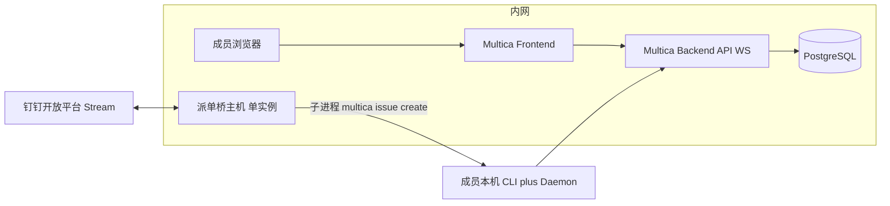

# Multica 内网生产环境 — 设计说明

> **状态**：已定稿供评审；实施以 `docs/superpowers/plans/2026-04-21-multica-selfhost-production-deploy-runbook.md` 为准。  
> **日期**：2026-04-21  
> **范围**：在保留「制作人本机 Cloud + 钉钉桥调试」的前提下，新增 **内网正式 Multica（自托管）** 的边界、角色、依赖与协作接口；与既有 `2026-04-18-multica-integration-design.md` 对齐并扩展 **方案 B**。

---

## 1. 文档索引（给交接同事）

| 文档 | 读者 | 用途 |
|------|------|------|
| `2026-04-21-multica-internal-handoff-bundle.md` | 交接 / 一次性转发 | **合并版**：设计 + Runbook + 协作指南 + 钉钉桥 README 单文件 |
| 本文 | 制作人 / 架构 / 运维 | **为什么这样切**、边界、风险、与 Cloud 调试关系 |
| `docs/superpowers/plans/2026-04-21-multica-selfhost-production-deploy-runbook.md` | 负责落地的工程师 | **按任务勾选**完成部署与验收 |
| `docs/superpowers/specs/2026-04-21-multica-internal-collaboration-guide.md` | 全体使用者 | 上线后 **日常怎么用**（Web、CLI、钉钉、WORK_LOG） |

上游权威（版本以官方仓库为准）：

- [SELF_HOSTING.md](https://github.com/multica-ai/multica/blob/main/SELF_HOSTING.md)
- [SELF_HOSTING_ADVANCED.md](https://github.com/multica-ai/multica/blob/main/SELF_HOSTING_ADVANCED.md)

---

## 2. 背景与目标

### 2.1 现状

- **调试环境**：制作人本机使用 **Multica Cloud**（`multica.ai`）+ 本机 `multica` CLI + 可选 **`tools/multica-dingtalk-bridge`**（钉钉 Stream 入站派单）。用于个人试流程、脚本联调。
- **缺口**：缺少 **数据驻留在内网**、**团队共用同一真相源** 的正式实例；Cloud 与内网合规策略可能不一致。

### 2.2 目标（可验收）

1. **内网可访问**：浏览器可打开正式 Web；API/WebSocket 经内网域名或 IP 可达（生产建议 HTTPS + 反代）。
2. **队列真相源**：团队默认在内网 Multica **Workspace** 内创建、认领、关闭 Issue；与个人 Cloud 调试板 **刻意分离**。
3. **钉钉派单**：**仅一套** 生产机器人 Stream 连接对应 **单实例派单桥**（见 §5）；建单写入 **内网** Multica（通过桥所在机的 CLI 指向内网 `server_url` / `app_url`）。
4. **可运维**：备份、升级路径、负责人明确；故障时有降级说明（见 Runbook）。

### 2.3 非目标（首版不做）

- 不迁移历史 Cloud Issue 自动对账（若需要，另开专项与时间点）。
- 不在本文规定 **LLM 供应商** 选型；daemon 本机执行仍受各 Agent CLI 与网络策略约束（与 Multica 服务是否内网无关）。
- 不把 Multica 替代 pm-system 等业务数据（与既有 spec 一致）。

---

## 3. 方案定位（与既有 §3 对齐）

| 条目 | 调试（个人） | 生产（团队） |
|------|--------------|--------------|
| Multica 服务 | Cloud `multica.ai` | **自托管**（Docker：Frontend + Backend + Postgres） |
| 数据驻留 | 依 Cloud 条款 | **内网** |
| 钉钉桥 | 本机可启停 | **固定一台**常驻；**禁止**同 Client ID 多机并发 |
| CLI `multica config` | 个人可指向 Cloud | 正式协作机 **指向内网 URL** |

对应既有文档 **方案 B：全栈自托管（Docker，内网）**；个人调试继续可用 **方案 A**，两套并存时以 **URL 与 workspace** 区分，避免误操作。

---

## 4. 逻辑架构

要点：

- **状态与协作** 在 Multica（Issue、评论、状态、指派）。
- **Agent daemon** 仍在各人电脑，向 **内网 Backend** 注册 Runtime；不在 Docker 内跑同事 IDE。
- **钉钉桥** 只做入站（及可选出站 Webhook），**不是** Multica 子服务；代码在 `tools/multica-dingtalk-bridge/`，与 multica 官方镜像 **独立发布周期**。

---

## 5. 钉钉派单桥 — 生产约束（必须遵守）

1. **同一钉钉应用（同一 Client ID）** 对应 **唯一** `dispatch_bot.py` 进程；多机同时跑会抢 Stream，行为不可预期（仓库 README 已说明）。
2. **桥所在机** 必须：安装 `multica` CLI、完成 **对内网** 的 `multica setup self-host`（或等价 `config set server_url` / `app_url`）、`multica auth status` 可用；且该机能访问钉钉开放网络与内网 API。
3. **环境变量**：生产 `.env` 中建议显式设置 **`MULTICA_APP_URL`**（与内网前端一致），保证机器人回复里「点击查看」指向内网而非 `multica.ai`。
4. **密钥**：`DINGTALK_CLIENT_*` 仅密码库或受控渠道交接，**禁止**贴群、进 Git。

---

## 6. 角色与职责（RACI 摘要）

| 事项 | 运维 / 部署同事 | 队列 Owner | 普通成员 |
|------|-----------------|------------|----------|
| Docker、反代、证书、DB 备份 | R/A | I | I |
| 内网域名、防火墙放行策略 | R | I | I |
| 正式 Workspace / Project 命名与归档规则 | C | A | I |
| 派单桥部署机选型与启停窗口 | R | A | I |
| Issue 纪律、拆单、WORK_LOG 互链 | I | A | R |

（R=执行，A=拍板，C=协商，I=知会）

---

## 7. 安全与合规

- **认证**：生产默认关闭「万能验证码」；优先企业可接受的 **邮件验证码**（`RESEND_API_KEY` 等，见官方文档）或组织规定的 IdP 路径（若后续集成）。纯内网评估期若用 `APP_ENV=development`，**必须**网络层保证 **公网不可达**。
- **传输**：对前端与 API 使用 **HTTPS**；WebSocket 与反代超时按 `SELF_HOSTING_ADVANCED.md` 调整。
- **敏感描述**：工单正文仍可能含业务细节；强合规场景在 Issue 写 **「详见内网 WORK_LOG / 某路径」**，正文脱敏（对应既有 **方案 C** 思路）。

---

## 8. 与既有试点文档的关系

- `2026-04-18-multica-integration-design.md`：协作纪律（关单、WORK_LOG、拆单 §7.1）**继续有效**。
- `2026-04-18-multica-integration.md`（plan）：偏 Cloud + 本机桥 **试点实施**；本设计将 **生产后端** 迁到内网后，桥与 CLI 的 **URL 与凭据** 切换以 Runbook 为准。

---

## 9. 修订记录

| 日期 | 变更 |
|------|------|
| 2026-04-21 | 初版：内网生产 + 调试并存、单桥、三文档拆分。 |
