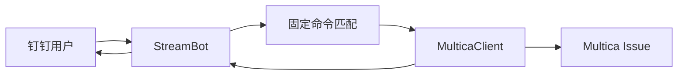
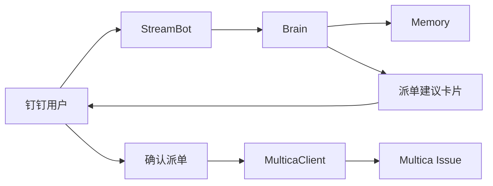

# Multica Stream Agent 第一阶段设计

> 状态：设计 spec
> 日期：2026-04-27
> 范围：在现有 `tools/multica-dingtalk-bridge` 独立 Stream 机器人基础上，演进出可对话、可澄清、可提取记忆候选的 Multica 队列管家 Agent 雏形。

---

## 1. 背景

现有 `multica-dingtalk-bridge` 已经能通过钉钉 Stream 接收固定命令，并调用本机 `multica` CLI 完成建单、取消派单、查工单。

本阶段不把 Hermes 或 OpenClaw 作为必需依赖。机器人自身作为 Multica 工单入口和流程主控，逐步沉淀记忆与 Skill；Hermes、OpenClaw、Cursor Agent 后续可作为可选后端，而不是第一阶段架构前提。

---

## 2. 产品定位

第一阶段定位为：**Multica 队列管家 Agent 的雏形**。

它不是通用聊天 Agent，而是围绕 Multica 工单闭环工作的垂直 Agent：

- 接收钉钉里的碎片需求。
- 澄清不完整需求。
- 归类需求并给出派单建议。
- 用户确认后创建 Multica Issue。
- 提取会话、工单、长期候选记忆。
- 生成只读巡查摘要。

第一阶段不做：

- 自动执行代码任务。
- 自动认领工单。
- 自动提交或推送 Git。
- 自动大范围修改 Multica 状态。
- 依赖 Hermes / OpenClaw 才能工作。

---

## 3. 设计原则

### 3.1 固定命令优先

现有 `派单`、`#派单`、`查工单`、`取消派单`、`删除派单` 是行为金线，必须先匹配固定命令，再进入 LLM 对话层。

### 3.2 外部自然，内部结构化

用户看到的是自然对话，不是表单字段。机器人内部必须产生结构化结果，便于建单、测试、回放和记忆提取。

### 3.3 记忆分级晋升

低风险事实可以自动沉淀；会影响长期行为的偏好、规则、权限必须进入待审核候选。

### 3.4 Agent 能力可生长

第一阶段先做队列管家。后续可逐步接入巡查、认领、状态维护、验收提醒、外部 Agent 执行器，成长为与 Hermes / OpenClaw 并列的垂直业务 Agent。

---

## 4. 第一阶段模块

第一阶段只拆 4 个核心模块，避免过度架构化。

### 4.1 StreamBot

职责：

- 钉钉 Stream 接入。
- 解析消息正文，剥离群聊前置 @。
- 固定命令路由。
- 调用 `Brain` 处理非固定命令。
- 回复钉钉，保留现有互动卡片到 Markdown 再到文本的降级链。

建议从现有 `dispatch_bot.py` 平滑演进，不另起一套入口。

### 4.2 MulticaClient

职责：

- 封装本机 `multica` CLI 调用。
- 第一阶段支持建单、查单、取消派单。
- 为后续评论、状态更新、指派、详情查询预留方法。

目标是把散落的子进程调用集中起来，供固定命令和 LLM 建议共用。

### 4.3 Brain

职责：

- LLM 对话。
- 需求澄清。
- 需求归类。
- 派单建议。
- 只读巡查摘要。
- Skill 摘要加载。
- 记忆候选提取。

Brain 对外输出自然语言；对内输出结构化对象。

### 4.4 Memory

职责：

- 会话记忆。
- 工单记忆。
- 低风险长期事实。
- 待审核长期候选。

第一阶段不做复杂向量库。优先使用本地 JSONL 或 SQLite，保证可读、可备份、可排障。

---

## 5. 对话与建单流程

### 5.1 固定命令路径



命中固定命令时，不调用 LLM。

### 5.2 自然语言派单建议路径



流程：

1. 用户用自然语言描述需求。
2. Brain 判断意图和信息完整度。
3. 如果缺少关键验收信息，只追问 1 个关键问题。
4. 如果信息足够，生成派单建议卡片。
5. 用户明确确认后，创建 Multica Issue。

---

## 6. LLM 内部结构

Brain 内部建议输出以下结构，外部不直接展示完整 JSON。

```json
{
  "intent": "dispatch_suggestion",
  "category": "feat",
  "confidence": 0.82,
  "missing_info": [],
  "suggested_title": "修复 PM 系统成员筛选异常",
  "suggested_description": "背景、范围、验收说明",
  "definition_of_done": [
    "成员筛选在空条件和多条件下结果正确",
    "无新增前端报错"
  ],
  "priority": "medium",
  "split_suggestion": "无需拆单",
  "recommended_action": "ask_confirm",
  "memory_candidates": []
}
```

低置信度、缺少 DoD、影响范围不清时，`recommended_action` 应为 `ask_clarification`。

---

## 7. 记忆规则

### 7.1 记忆类型

第一阶段分 4 类：

- `session_memory`：同一钉钉会话内的上下文，自动写入，自动过期。
- `issue_memory`：绑定 Multica Issue 的澄清结果、DoD、验收点、提醒记录。
- `knowledge_memory`：低风险事实，允许自动写入。
- `pending_memory`：影响长期判断的候选记忆，必须审核后晋升。

### 7.2 可自动写入

- 项目路径。
- 服务端口。
- Multica CLI 使用经验。
- 机器人自身排障结论。
- 明确的项目边界事实。
- 低风险环境知识。

### 7.3 需要审核

- 老大的派单偏好。
- 需求分类标准。
- 验收口径。
- 自动化权限。
- 是否允许某类需求自动建单。
- 会影响机器人长期判断的工作流规则。

### 7.4 禁止写入

- 密钥、token、Client Secret。
- 人事敏感判断。
- 未脱敏的内网敏感信息。
- 一次性情绪或临时场景。

---

## 8. Skill 规则

第一阶段采用混合真源。

### 8.1 `.cursor` 真源摘要

机器人可只读加载以下摘要：

- 数字分身口径。
- PM 工作日口径。
- Git / 验收门禁摘要。
- 钉钉消息规范。
- 多 Agent 身份同步原则。

这些内容以 `.cursor/skills` 和 `.cursor/rules` 为真源，机器人不维护第二份核心规则。

### 8.2 机器人私有 Skill

机器人可以维护自己的私有 Skill：

- Multica 派单分类。
- 需求澄清模板。
- 只读巡查摘要模板。
- 验收提醒文案。
- 工单记忆提取规则。

私有 Skill 只处理 Multica 工单流，不替代 Cursor 全局规则。

---

## 9. 只读巡查摘要

第一阶段加入只读巡查摘要，但不做自动认领和状态修改。

机器人可基于 `multica issue list` 生成：

- 待办概况。
- 进行中概况。
- 待验收概况。
- 阻塞项。
- 久未更新项。
- 缺 DoD 或标题不清的工单。
- 今日建议关注列表。

只读巡查摘要只能提出建议，例如：

- 哪些工单建议补 DoD。
- 哪些工单建议拆单。
- 哪些工单建议提醒验收。
- 哪些工单疑似长时间无更新。

第一阶段不允许巡查器自动：

- 认领工单。
- 改状态。
- 触发代码执行。
- 创建批量子单。

---

## 10. 错误处理与安全边界

### 10.1 LLM 失败

LLM 调用失败时：

- 固定命令仍可用。
- 自然语言派单建议返回简短失败说明。
- 不创建工单。

### 10.2 结构解析失败

LLM 返回无法解析时：

- 不执行写操作。
- 回复用户“我没有把需求结构化清楚，请重新描述或用固定派单格式”。
- 记录原始响应摘要用于排障，不记录敏感全文。

### 10.3 重复消息

钉钉 Stream 可能重试。第一阶段应记录最近消息指纹，避免重复建单。

### 10.4 敏感信息

机器人在建单前应提示或拦截明显敏感内容，例如 token、secret、password、api_key。

---

## 11. 第一阶段验收标准

1. 旧命令不退化：`派单`、`查工单`、`取消派单` 仍可用。
2. 自然对话可用：能回答“这个需求怎么派”。
3. 需求不清时只问关键问题，不一次性抛长清单。
4. 用户确认后，能按建议创建 Multica Issue。
5. 每轮关键对话能提取记忆候选。
6. 记忆候选能区分自动写入和待审核。
7. 同会话、同工单不重复问已确认信息。
8. 能加载最小 Skill 摘要。
9. 能生成只读巡查摘要。
10. LLM 失败不影响固定命令。

---

## 12. 后续阶段预留

第二阶段可加入：

- 受控评论。
- 受控状态维护。
- 验收提醒外呼。
- 每日对账。
- 工单记忆回放。

第三阶段可加入：

- 自动巡查。
- 自动认领。
- 执行体调度。
- Hermes / OpenClaw / Cursor Agent 后端适配。
- 完整巡查、执行、验收闭环。

---

## 13. 当前决策摘要

- 采用方案 A：现有独立 Stream 机器人继续演进。
- 第一阶段不依赖 Hermes / OpenClaw。
- 机器人可逐步成长为与 Hermes / OpenClaw 并列的垂直 Agent。
- 记忆策略为：低风险自动写入，长期判断候选审核晋升。
- Skill 策略为：`.cursor` 核心规则只读摘要 + 机器人私有 Multica Skill。
- 第一阶段加入只读巡查摘要，不加入自动巡查闭环。
