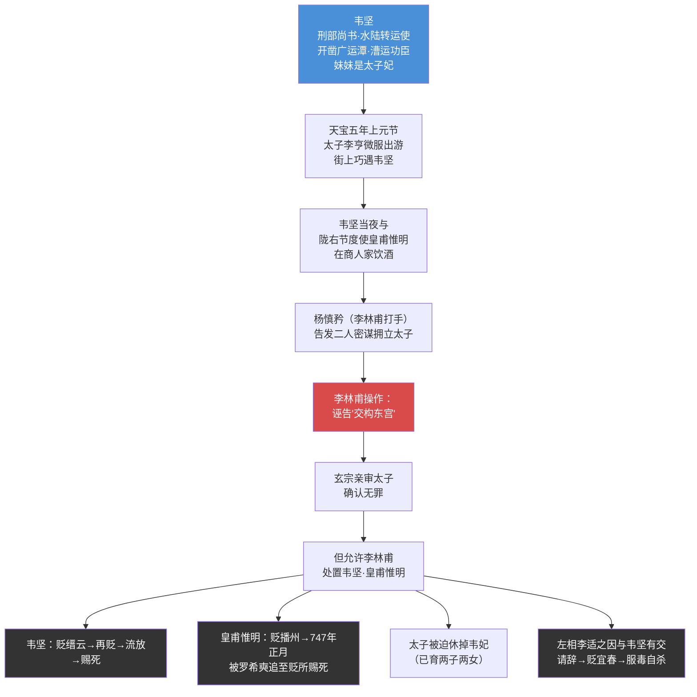
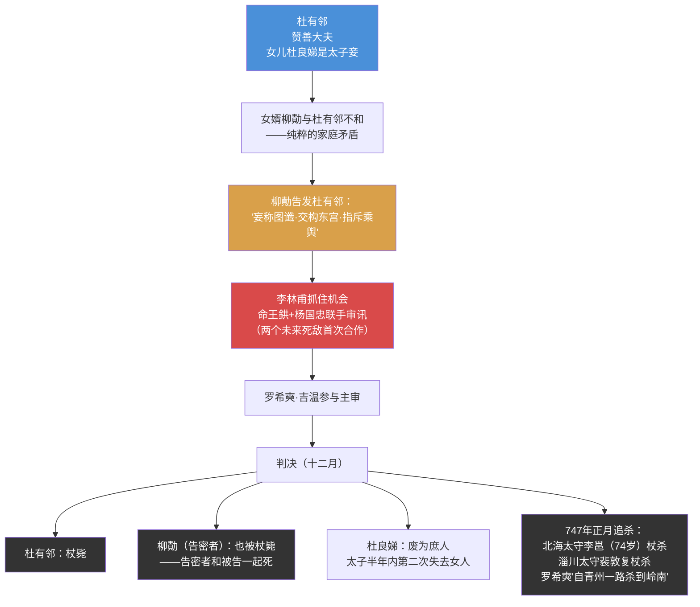
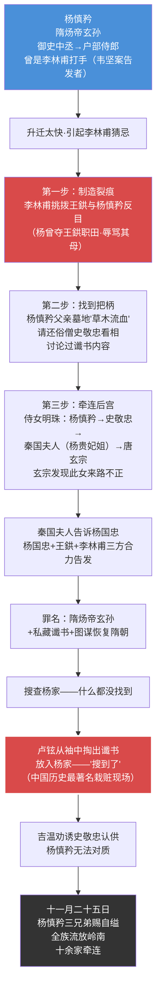
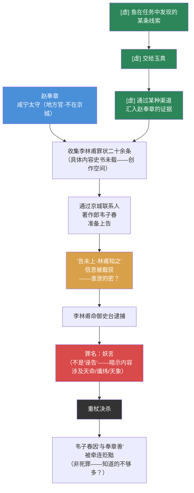

# 主时间线图

```mermaid
timeline
    title 谪仙局 · 前传至卷一（732—749）

    section 前传·盛世暗裂（732—738）
        732年·开元二十年
            : [史] 金仙公主去世（44岁·通感燃尽）
            : [虚] 余小满同年出生于宣州
            : [虚] 先生（李含光）核心创伤形成——"我没能救她"
            : [虚] 司马承祯观测到天象异动
        735年·开元二十三年
            : [史] 司马承祯去世（96岁）
            : [虚] 临终密封"观测记录"第三段——"南水有鱼。鱼不知水。至岸方醒"
            : [虚] 先生继任茅山宗第十三代宗师·开启密封件
        737年·开元二十五年
            : [史] "一日杀三子"——太子李瑛、鄂王李瑶、光王李琚被废赐死
            : [史] 武惠妃精神崩溃·同年去世
            : [史] 张九龄因反对杀子被贬荆州——最后一个敢说真话的宰相出局
            : [史] 李林甫升为首席宰相·"数劝上立寿王瑁"——押注失败
        738年·开元二十六年
            : [史] 高力士进言"推长而立"·李亨立为太子
            : [史] 李林甫与太子结构性死局形成

    section 前传·暗处布局（740—745）
        740年
            : [史] 张九龄病逝于荆州（68岁）
        744年·天宝三年
            : [史] 玉真公主上书削号·归还食邑——从明处退入暗处
            : [史] 高力士进谏"军国之柄未可假人"——被玄宗忽略
            : [虚] 余小满（12岁）被道门从宣州送入长安玉真观
            : [虚] 玉真收下小满——隐秘理由：走神的样子像金仙
        745年·天宝四年
            : [史] 杨玉环册封为贵妃·"五杨"权势开始膨胀

    section 卷一·血腥之年（746）
        746年正月·韦坚案
            : [史] 上元节太子李亨微服出游·巧遇韦坚
            : [史] 韦坚当夜与陇右节度使皇甫惟明在商人家饮酒
            : [史] 杨慎矜（李林甫打手）告发二人"密谋拥立太子"
            : [史] 玄宗亲审太子·确认无罪——但允许李林甫处置韦坚
            : [史] 韦坚贬缙云太守·再贬·最终赐死
            : [史] 皇甫惟明被贬·次年被罗希奭追杀赐死
            : [史] 太子被迫休掉太子妃韦氏（已育两子两女）
        746年正月·穿越
            : [虚] 玉真观内堂·古琴声中余小满通感大爆发
            : [虚] 余小满灵魂消散·鱼的灵魂坠入
            : [虚] 玉真亲眼目击——警觉·兴奋："也许她能割开一道口子"
        746年十一月·杜有邻案
            : [史] 柳勣（女婿）告发岳父杜有邻"妄称图谶·交构东宫"
            : [史] 李林甫命王鉷+杨国忠联手审讯——两个未来死敌首次合作
            : [史] 杜有邻杖毙·告密者柳勣也被杖毙——荒谬
            : [史] 太子半年内第二次失去女人——杜良娣废为庶人
            : [史] 74岁北海太守李邕被牵连杖杀
            : [史] 前左相李适之在恐惧中服毒自杀
            : "图谶"从此成为长安上空的一把刀

    section 卷一·绞杀深化（747）
        747年正月
            : [史] 罗希奭受命追杀被贬的韦坚·皇甫惟明等人——赐死或杖杀于贬所
        747年·"野无遗贤"
            : [史] 科举无一人录取·李林甫称"天下无遗贤"
            : [史] 杜甫参加了这次科举——无果
        747年·王忠嗣案
            : [史] 王忠嗣（四镇节度使·太子幼时好友）反对强攻石堡城
            : [史] 董延光攻城失败后反诬王忠嗣不配合
            : [史] 李林甫指使魏林诬告"拥兵尊奉太子"
            : [史] 哥舒翰冒死求情·王忠嗣免死·贬为汉阳太守
            : [虚] 鱼在观中渐渐站稳·玉真开始小规模测试她的能力
        747年十一月·杨慎矜案
            : [史] 李林甫挑拨王鉷与杨慎矜（原盟友·隋炀帝玄孙）反目
            : [史] 杨慎矜与还俗僧史敬忠讨论谶书——被抓住把柄
            : [史] 侍女明珠经秦国夫人传入宫中——后宫信息通道触发告发链
            : [史] 李林甫+王鉷+杨国忠三方合力告发
            : [史] 卢铉搜查杨家无所获——从袖中掏出谶书栽赃
            : [史] 杨慎矜三兄弟自缢·全族流放
            : "谶书"成为灭族罪名——道门谶语传承面临存在性威胁

    section 卷一·暗流涌动（748）
        748年·天宝七年
            : [史] 王鉷升任户部侍郎·兼20余使职·掌管国家财政
            : [史] 王忠嗣暴卒于汉阳（45岁·死因存疑）
            : [虚] 玉真正式启用鱼——"从今天起你替我想事"
            : [虚] 鱼与清漪从警惕转向冷淡的职业合作
            : [虚] 先生来长安"看看这个孩子"——震惊："窗不是长出来的，是装上去的"

    section 卷一·高潮与代价（749）
        749年·天宝八年
            : [史] 哥舒翰攻石堡城——死数万人的"胜利"
            : [史] 李林甫奏停折冲府上下鱼书——府兵制正式废止·中央无兵
            : [史] 唐玄宗追尊道祖为"大道玄元皇帝"
            : [虚] 鱼在任务中触碰到杨慎矜案栽赃的线索——交给玉真
            : [虚] 信息经玉真传出·最终汇入赵奉章的二十条罪状
        749年·赵奉章案
            : [史] 咸宁太守赵奉章告发李林甫罪状二十余条
            : [史] "告未上·林甫知之"——信息被截获
            : [史] 以"妖言"罪重杖决杀
            : [史] 著作郎韦子春因与赵奉章友善·被牵连贬黜
            : [虚] 鱼听到消息·心中莫名不安——她不知道赵奉章的死和自己有关
            : 最后一个说真话的人死了
```

---

## 补充：四大案详细来龙去脉速查表

> 供写作时随手查阅

### 案一：韦坚案（746年正月）

**关键人物背景：**
- **韦坚**：京兆万年人。理财能手——开凿广运潭改善漕运，每年增税巨万。妻子是李林甫舅父之女（和李林甫有亲戚关系！但仍被杀）。妹妹是太子正妃。李林甫怕他升为宰相威胁自己
- **皇甫惟明**：陇右节度使。入朝时曾当面建议玄宗罢免李林甫——直接触了李林甫逆鳞
- **李适之**：左相。和韦坚有交往。韦坚案后主动请辞——但仍被迫害到自杀。其子李适也被杖杀

---

### 案二：杜有邻案（746年十一月）

**关键细节：**
- **"图谶"罪名第一次出现**——此后成为李林甫的标准武器
- **柳勣和杜有邻一起死**——告密者本人也被杖毙。说明玄宗知道案子有问题，但选择"两边都杀"而非追究真相
- **王鉷和杨国忠的首次合作**——两人此后的关系从合作→竞争→你死我活
- **追杀范围极大**——罗希奭从山东一路杀到岭南。李邕74岁，唐代著名书法家，被杖杀

---

### 案三：杨慎矜案（747年十一月）——最精密的一次

**关键细节：**
- **杨慎矜曾是李林甫的打手**——韦坚案就是他告发的。现在"用完就杀"
- **"谶书"罪名升级**——从杜有邻案的"妄称图谶"到此案的"私藏谶书"，而且**物证是伪造的**
- **四步操作极其精密**：制造裂痕→找到把柄→牵连后宫→栽赃。三个派系（李林甫+王鉷+杨国忠）合力完成
- **卢铉袖藏谶书**——搜查无果后，从袖子里掏出谶书放进去。这个动作被史书完整记录
- **杨慎矜弟弟杨慎名在狱中写下绝笔信后自缢**——762年平反昭雪

---

### 案四：赵奉章案（749年）

**关键细节与未解之谜：**
- **赵奉章不是京官**——咸宁太守，关中地方官。一个地方官怎么收集到宰相的二十条罪状？
- **"告未上，林甫知之"**——状纸还没递到皇帝面前就被截获。**谁泄了密？** 这是卷一最大的悬念之一
- **韦子春**——著作郎（国史编修文官），赵奉章在京城的唯一已知联系人。被贬但没死——说明李林甫认为他知道的不够多
- **罪名是"妖言"不是"诬告"**——暗示二十条罪状中有涉及天命/谶纬的内容。也许他知道杨慎矜案是栽赃的？
- **二十条罪状的具体内容完全不知**——史书只说"罪状二十馀条"。内容消失了。**这是我们最大的创作空间**
