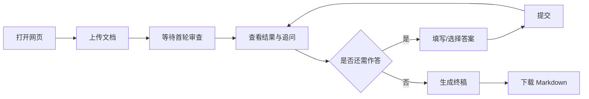

# 策划方案审查 · 网页交互服务（产品设计说明）

**文档版本**：0.4  
**更新日期**：2026-04-11  
**读者**：产品经理、项目经理、前后端/服务端工程师、测试、数据分析  

---

## 文档目的

说明本产品的**期望状态**、**WHAT/HOW/BUILD/MAKE 分层**，以及**分期落地路线**（先 MVP 再迭代），便于评审排期、拆分迭代与跨角色对齐。

**不包含**：具体类名、接口字段级定义、Prompt 全文（见《Agent 版设计说明》）。

---

## 0. 期望状态（我们最终要达成什么）

**一句话**：策划在**任意浏览器**中完成「上传方案 → 本地模型按统一 Skill 审查 → 根据追问作答 → 下载终稿报告」，团队能**持续度量使用情况与评审质量**，并**定期复盘改进**审查工具本身，而不是依赖少数人 IDE 内的临时对话。

**关键结果画面**：

- **对策划**：不用装 Cursor、不用敲命令行；等待时间可预期；结论可带走（Markdown）。
- **对组织**：使用与质量**可量化**（至少：活跃、漏斗、满意度）；对评审质量的**反馈可汇总**；改进有**版本与节奏**（Skill/Prompt/模型变更可回溯）。
- **对工具维护者**：不是「一次上线」，而是**可观测 → 反馈 → 复盘 → 进化**的闭环。

---

## 1. WHAT（做什么、做到什么算成功）

### 1.1 要解决的问题

- 命令行脚本难以支撑**追问与制作人裁决**；IDE 内强模型体验好，但**无法覆盖全员策划**日常路径。
- 审查工具若不可度量，就无法回答：**谁在什么场景用、结果是否可信、该不该继续投人力改 Skill/Prompt**。

### 1.2 成功标准（建议）

| 维度 | 标准 |
|------|------|
| **可用** | 策划仅用浏览器完成从上传到终稿下载的主路径；异常路径有清晰提示。 |
| **一致** | 审查判据以仓库 Skill 为权威，避免「网页一套、脚本一套」长期分叉。 |
| **可改进** | 能回答「本周有多少人用、卡在哪一步、用户对评审是否满意」；重大 Skill/Prompt 变更**有记录、可对比**。 |

### 1.3 范围边界

| 包含 | 不包含（首版或长期） |
|------|----------------------|
| 本机/内网 Ollama（如 gemma4）为主力引擎 | 强制唯一依赖云端闭源 API |
| 网页上传、多轮交互、终稿下载 | 自动回写策划的 docx/pdf 成稿 |
| 可选 Webhook 推送进度 | 与 PM 系统深度打通（可作为后续） |

### 1.4 名词

| 术语 | 含义 |
|------|------|
| Skill | 仓库内 `.cursor/skills/` 下的审核判据与输出结构（以 game-review 为主线）。 |
| 会话 | 一次从上传到终稿的完整交互，由服务端生成唯一会话 ID。 |
| 首轮审查 | 上传后第一次模型调用，产出初审结论与待追问项。 |
| 终稿报告 | 多轮交互结束后，用户可下载的单一 Markdown 文件。 |

---

## 2. HOW（怎么达成：体验原则、数据与进化）

### 2.1 体验与产品原则

- **先跑通主路径，再堆能力**：上传 → 首轮 → 至少一轮追问 → 终稿下载，优于「功能很多但没人走完」。
- **等待可预期**：首轮可能耗时数分钟，界面须有明确加载态与防重复提交；长期用队列/排队提示承接并发。
- **审查定位**：默认是**辅助自检**，不等同制作人终审；终稿可选更强模型仅作后续增强项。

### 2.2 数据统计与量化（原则）

**目的**：区分「没人用」「用不好」「模型不好」与「流程卡死」，指导迭代优先级。

| 类别 | 关注点 | 说明 |
|------|--------|------|
| **分用户使用** | 日/周活、人均会话数、人均轮次 | MVP 使用 **玄石登录** 用户标识（见 §2.6）。 |
| **主路径漏斗** | 上传成功 → 首轮完成 → ≥1 次追问 → 终稿下载 | 找断点（卡在慢、还是卡在交互）。 |
| **健康度** | 超时率、失败率、排队时长 | 容量与 SLO，不靠「感觉慢」。 |
| **文档与风险代理** | 格式、长度、是否截断；首轮 P0/P1/P2 数量等 | 「提交质量」用**可计算特征 + 抽检**组合，避免单一玄学分数。 |

**原则**：埋点事件带 **Skill 版本 / Prompt 版本 / 模型标识**，否则无法复盘「这周差评是因为 prompt 改了还是模型换了」。

### 2.3 评审质量反馈（原则）

**目的**：把「好不好用」从口头变成可统计输入，驱动 Skill 与交互优化。

| 层级 | 建议 | 说明 |
|------|------|------|
| **MVP（必选）** | 终稿或会话结束：星级 + 可选多选原因等（见 §2.6、§3.1） | 漏风险/误报/追问不对/太慢等 |
| **增强（V1+）** | 对单条高亮问题点「有用/没用」 | 更利于定位哪类规则要改 |
| **校准（低频）** | 黄金样例 + 制作人/主策对照标注 | 防「只有不爽的人才反馈」的偏差 |

### 2.4 定期复盘与工具进化（原则）

**建议节奏**：双周或每月一次短复盘（可与内部工具例会合并）。

| 环节 | 内容 |
|------|------|
| **看板** | 漏斗、失败率、满意度、截断占比 |
| **归因** | Skill、Prompt、模型、主机负载，谁变了 |
| **行动** | 改 Skill、调追问、加队列、补黄金样例回归 |
| **记录** | 变更说明与版本号，保证可对比 |

### 2.5 模型与产品节奏：先推 MVP 还是先「调教到接近 B」？

**建议：先推 MVP 工具，再并行/迭代式把审查质量拉近 B 档。**

| 选项 | 说明 |
|------|------|
| **先 MVP** | 先验证「有没有人持续用、漏斗卡在哪、追问是否真被回答」；没有真实使用与反馈，**本地调教容易脱离场景**（调的是脚本跑分，不是策划工作流）。 |
| **并行** | MVP 用当前 Skill + gemma4 即可上线；**在后台**用固定样例集 + 对比报告持续改 Prompt/多轮策略，**小步发布**到网页。 |
| **后移** | 「终稿仅最后一轮用更强模型」等可作为 V1+，不影响 MVP 是否成立。 |

**结论**：**不阻塞 MVP**；审查质量改进是**持续迭代项**，用数据与黄金样例回归防止「越改越飘」。

### 2.6 关键产品决策（MVP 已拍板）

下列与实现强相关，评审与排期以本节为准。

| 编号 | 决策 |
|------|------|
| **登录** | MVP **必须**接入**玄石登录**，使用现成方案获取用户身份（分用户统计、审计与权限）。 |
| **埋点与反馈** | **均为必选**：结构化事件（日志/埋点）与 **用户评价反馈** 均须在 MVP 交付，不作为「可选」。 |
| **首轮与 Prompt** | 首轮审查与本地脚本 **C 档（单轮 v2）** 对齐；追问与终稿使用约定好的 prompt 变体（与《Agent 版》一致，由工程固化版本号）。 |
| **云文档链接** | **强制填写**；**写入终稿 Markdown 正文**（如「云文档（正本）」固定小节），回溯时**仅打开报告即可**定位当时对应的云文档。后台会话记录中**同时保存**该链接，便于统计与排错。 |
| **上传附件保留** | 服务器本地落盘的**上传快照**保留 **30 天**（自上传或自会话创建日起算等细则由工程在实现说明中写清）；正本以云文档为准。 |
| **会话与对话** | **长期保存**（用于多轮接续、终稿生成、漏斗统计、排错与合规留痕；保留策略与脱敏要求由合规确认）。 |
| **终稿** | 支持用户**本地下载**；同时在服务端 **永久归档**。归档采用**独立于研发业务仓库的 Git 仓**（仅存放终稿等内容，与代码发布解耦），便于负责人在**任意机器** `clone` 后抽检、复盘审查系统，**无需登录部署机**。 |
| **审计与互链** | 业务库（或等价存储）中终稿记录须与 Git 提交 **互链**（如 `git_commit` / 路径 + `session_id`）；**终稿文本随时间的证据链**可依赖该 Git 仓的提交历史；**全流程主体行为**（谁、何时、多轮原文等）以**会话与对话存储 + 应用日志**为准，与 Git **互补**，不单靠 `git log` 覆盖全部审计场景。 |
| **异常** | 对用户：**清晰、友好、可操作**的提示（含重试指引）；对维护方：**实时通知**（如 Webhook/钉钉等，通道由运维选定），并携带 `session_id`、错误类型与时间，便于处置。 |

---

## 3. BUILD（怎么分期建设系统）

按 **先跑通 MVP，再逐步迭代** 拆分；下列「交付物」为产品侧验收口径，技术实现见《Agent 版》。

### 3.1 阶段 A：MVP（必须最先）

**目标**：证明「浏览器闭环」可用，并能开始收集最小反馈。

| 交付 | 说明 |
|------|------|
| **玄石登录** | 现成方案接入，全站以登录用户身份运作（见 §2.6）。 |
| 上传 | md/txt/pdf/docx 等与现有脚本对齐；大小上限可配置；**上传快照本地落盘保留 30 天**（见 §5.7）。 |
| **云文档链接** | 必填；写入终稿正文；会话侧同步存储（见 §2.6、§5.7）。 |
| 首轮审查 | 本机 Ollama + Skill，**C 档单轮 v2**，结构化初审（含分级与追问） |
| 多轮交互 | 用户文本或选项作答，服务端保留上下文再调模型；**会话与对话长期保存**（见 §5.7）。 |
| 终稿下载 | 单一 Markdown 下载；**终稿永久归档**至独立 Git 仓并与业务记录互链（见 §5.7）。 |
| 会话隔离 | 不同会话不串档 |
| 基础可观测 | 日志含会话 ID、轮次、耗时、错误类型 |
| **埋点（必选）** | 关键事件可统计：会话创建、上传成功、首轮完成、追问轮次、终稿下载、失败/超时；**带 Skill/Prompt/模型版本元数据** |
| **用户反馈（必选）** | 如终稿后 1～5 星 + 可选多选原因 + 一句备注（具体控件由设计定） |
| **异常与告警** | 用户侧友好提示；维护侧实时通知（见 §2.6） |

**验收**：见本文第 5 节「MAKE · 验收口径」。

### 3.2 阶段 B：V1（MVP 跑通后）

| 交付 | 说明 |
|------|------|
| Webhook | 首轮完成、终稿就绪等事件推送（钉钉/飞书等） |
| 鉴权 / 会话恢复 | 视部署环境：内网口令或账号；链接恢复未结束会话（需安全策略） |
| **数据增强** | 漏斗看板或导出；按方案类型/用户聚合（在合规前提下） |
| **反馈增强** | 多选原因标签；可选对单条问题「有用/没用」 |

### 3.3 阶段 C：V1+（体验与容量）

| 交付 | 说明 |
|------|------|
| 队列与并发 | 后台任务、排队提示、限流策略 |
| 长文档策略 | 分块或提高上限时的用户提示 |
| **进化机制** | 黄金样例回归流程（与 Skill 发布绑定）；可选 A/B（不同 Prompt 小流量对比） |
| **更强模型** | 仅终稿汇总等可选环节（非唯一引擎），以成本与合规为准 |

---

## 4. MAKE（交付什么：对业务侧的产出）

### 4.1 对策划

- 可下载的 **Markdown 终稿**（含首轮发现、交互补充、汇总分级）。
- 对等待与失败有**可理解提示**，而非黑屏或无限转圈。

### 4.2 对组织/管理

- **使用与质量的可视化**：至少能回答活跃度、漏斗、满意度趋势（阶段 B 起更完整）。
- **改进可回溯**：重大变更对应版本号与简要说明，便于复盘「为什么某周满意度变化」。

### 4.3 验收口径（产品）

- 用户经 **玄石登录** 后，**仅通过浏览器**完成：上传 → 首轮结果 → **至少一次**追问作答 → **下载终稿**，无命令行依赖。
- 同一会话多轮作答后，终稿应**体现**用户输入或选择（抽样验收）；终稿正文须包含**云文档（正本）链接**（见 §2.6）。
- 异常路径有清晰、友好、可操作的提示；维护人员能收到**实时通知**（含会话与错误信息，见 §2.6）。
- 埋点与用户反馈均已上线且可汇总（见 §3.1）。
- 终稿在**独立 Git 归档仓**中可追溯提交，且与业务侧 `session_id` / commit **可对账**（见 §5.7）。

---

## 5. 附录：用户旅程与功能明细

### 5.1 用户旅程（happy path）



### 5.2 功能需求表（与分期对应）

**MVP**

| ID | 能力 |
|----|------|
| FR-01 | 文档上传 |
| FR-02 | 首轮审查 |
| FR-03 | 多轮交互 |
| FR-04 | 终稿与下载 |
| FR-05 | 会话隔离 |
| FR-06 | 玄石登录 |
| FR-07 | 埋点（必选）与用户反馈（必选）（见 3.1、§2.6） |
| FR-08 | 云文档链接必填并写入终稿；上传保留 30 天；会话与对话长期保存；终稿永久归档至独立 Git 仓（见 §5.7） |
| FR-09 | 异常友好提示与维护侧实时通知（见 §2.6） |

**扩展（V1 / V1+）**

| ID | 能力 |
|----|------|
| FR-O1 | Webhook（MVP 已含维护侧实时通知时，可与业务 Webhook 合并设计） |
| FR-O2 | 会话恢复（链接恢复未结束会话等） |
| FR-O3 | 鉴权增强（若 MVP 玄石之外仍有补充策略） |
| FR-O4 | 数据看板与反馈增强、黄金样例回归、队列与可选 A/B（见 3.2 / 3.3） |

### 5.3 非功能需求（摘要）

| 类别 | 要求 |
|------|------|
| 部署 | 单机或内网；主机预装 Ollama 与依赖 |
| 性能 | 长耗时步骤有加载态；防重复提交 |
| 安全 | 上传类型与大小校验；敏感方案内网部署与留存策略由项目定 |
| 合规 | 方案内容属业务资产；埋点优先事件级；**上传件、会话、终稿** 的存储位置、保留期与访问权限见 §5.7；独立 Git 仓的访问范围与脱敏要求单独约定 |

### 5.4 与现有资产的关系

- **逻辑复用**：`palace/game_review/game_review_ollama.py` 中的 Skill 嵌入与调用方式应由工程侧抽取复用，避免网页与脚本两套判据。
- **Skill 权威**：以仓库 `.cursor/skills/` 为权威；发布升级需冒烟（样例文档跑通）。

### 5.5 风险与开放问题（摘要）

| 风险 | 产品侧建议 |
|------|------------|
| 本地模型能力上限 | 明确辅助自检定位；终稿更强模型为 V1+ |
| 长文档截断 | UI 提示；V1+ 分块策略 |
| 并发与排队 | V1+ 队列与预计等待时间 |
| 反馈偏差 | 搭配低频抽检与黄金样例 |

### 5.6 本地脚本与「升炮赛四版对比」（A / C / D）对应说明

《升炮赛》审核对比报告中的 **A / B / C / D** 与当前仓库脚本关系如下，供与 **MVP 首轮（建议 C 档单轮 v2）** 对齐时引用。

| 代号 | 含义 | 与 `palace/game_review/game_review_ollama.py` 的关系 |
|------|------|--------------------------------------------------------|
| **A** | gemma4 · 单轮 · **v1（基础）prompt** | **脚本当前未内置 v1**；仓库仅保留当时跑出的报告样例 `升炮赛_game_review.md`，作历史对照，**非**默认行为。 |
| **B** | Cursor 强模型 · 对话交互 | **非**本脚本；制作人追问与裁决无法由单次本地调用替代。 |
| **C** | gemma4 · 单轮 · **v2 prompt**（宁严勿松、矛盾与空参数等） | **对应当前脚本的默认单轮**：不加 `--multi-pass`，即与对比报告中的 **C 版**一致；报告样例见 `升炮赛_game_review_v2.md`。 |
| **D** | gemma4 · **multi-pass**（按引擎分步再汇总） | 命令行加 **`--multi-pass`**；更深、更慢，报告样例见 `升炮赛_game_review_v3_multipass.md`。 |

**命令示例（路径按本仓库）**：

```text
# C 版（默认单轮 v2，MVP 首轮审查建议与此档对齐）
py palace/game_review/game_review_ollama.py 方案.md -o 审核报告.md

# D 版（multi-pass）
py palace/game_review/game_review_ollama.py 方案.md --multi-pass -o 审核报告.md
```

环境变量与依赖见脚本文件头注释（如 `GAME_REVIEW_LLM_API_BASE`、`GAME_REVIEW_LLM_MODEL`）。

### 5.7 数据留存、云文档与终稿归档（Git）

**目的**：区分「临时文件」「业务持久化」「终稿证据链」与「抽检复盘路径」，与 §2.6 决策一致。

#### 两类存储（人话）

| 类型 | 含义 | MVP 约定 |
|------|------|----------|
| **落盘（文件）** | 服务器磁盘上的实际文件（如上传的 pdf/docx） | 上传快照落盘，**保留 30 天**后删除；删除策略以实现说明为准（如会话结束后延迟删除等）。 |
| **存储（库表/服务）** | 会话、对话、链接、埋点、反馈、终稿元数据等结构化记录 | **会话与对话长期保存**；云文档链接与玄石用户标识存于业务库，供统计、排错与审计互链。 |

**云文档**：策划案**正本**在云侧；因权限限制，系统以**上传快照**供模型阅读。**云文档链接必填**，且须出现在**终稿 Markdown** 固定章节，便于日后只打开报告即可回溯「当时对应哪份云文档」。后台**同时保存**同一条链接。

#### 终稿：下载 + 永久归档 + 独立 Git 仓

- 用户侧：**本地下载** Markdown 终稿。  
- 组织侧：终稿在服务端 **永久保存**；其中 **Git 归档**使用**与研发业务代码隔离的独立仓库**（仅终稿及相关元数据/目录约定，不混入产品代码发布流程）。  
- **用途**：负责人在任意环境 `clone` 该仓即可 **抽检、 diff、按时间复盘审查系统**，**无需 SSH 部署机**。  
- **提交规范（建议）**：`commit message` 或路径中包含 **`session_id`**（及可选时间、云文档 id）；业务库中终稿记录保存对应 **`git_commit` 或文件路径**，实现 **互链对账**。  
- **审计边界**：**终稿文本**随时间的变更证据链 → 可主要依靠 **Git 历史**；**谁、何时、完整多轮交互** → 依靠 **业务库中的会话与对话 + 应用日志**；二者 **互补**，不互相替代。

#### Git 与「全流程审计」

- **git log** 能很好支撑：**终稿内容曾经长什么样、何时入库**。  
- **不能单独替代**：未写入 Git 的会话过程、登录主体与内部操作细节——须与 **长期会话存储及日志** 结合使用（见 §2.6）。

---

## 6. 修订记录

| 版本 | 日期 | 说明 |
|------|------|------|
| 0.1 | 2026-04-11 | 初稿 |
| 0.2 | 2026-04-11 | 重组 WHAT/HOW/BUILD/MAKE；补充数据、反馈、复盘与分期；明确 MVP 优先 |
| 0.3 | 2026-04-11 | 附录 §5.6：本地脚本与升炮赛 A/C/D 对应及用法示例 |
| 0.4 | 2026-04-11 | §2.6 MVP 已拍板（玄石、埋点与反馈必选、云链接、留存、终稿 Git 归档、异常通知）；§5.7 数据留存与审计；§3.1/§4.3/§5.2/§5.3 同步 |
